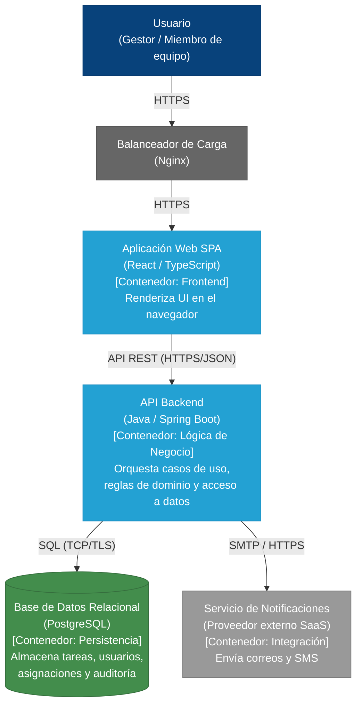
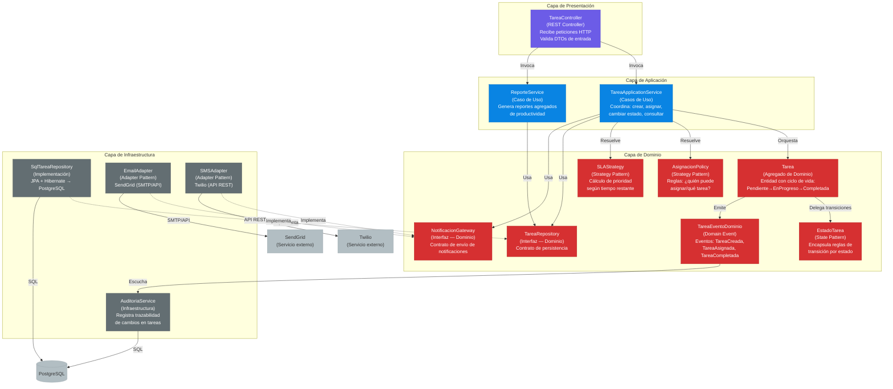

# Arquitectura en Capas Distribuidas — Sistema de Tareas

**Escenario:** Se determinó que una arquitectura en capas distribuidas era la adecuada para el Sistema de Tareas.

---

## 1. ADR 001 — Arquitectura en Capas Distribuidas (N-tier)

### Estado

Aceptado

### Contexto

El Sistema de Tareas es una plataforma de gestión de trabajo para una empresa mediana con equipos distribuidos geográficamente. Los requerimientos clave incluyen:

- **Usuarios:** De 100 a 10,000 usuarios concurrentes.
- **Funcionalidad:** Creación, edición, asignación y seguimiento de tareas con ciclo de vida por estados (Pendiente, En Progreso, Completada, Cancelada).
- **Notificaciones:** Avisos por correo electrónico y SMS ante cambios de estado o asignaciones.
- **Reportes:** Consultas agregadas de productividad, cargas de trabajo y tiempos de resolución.
- **Requerimientos No Funcionales:** Consultas de tareas < 200ms, alta disponibilidad en horario laboral, separación de responsabilidades por área operativa (frontend, lógica de negocio, base de datos).

Inicialmente se evaluó un **monolito en capas** (único despliegue con capas lógicas internas), el cual ofrecía simplicidad operativa y transacciones directas. Sin embargo, la necesidad de escalar horizontalmente el frontend durante picos de demanda, aislar la base de datos en una zona de red segura (DMZ) y permitir que equipos distintos mantuvieran cada tier de forma independiente inclinó la balanza hacia una arquitectura de **capas distribuidas**.

### Decisión

Se decide implementar una arquitectura en **capas distribuidas (N-tier)** con tres tiers físicos:

1. **Tier de Presentación:** Aplicación Web SPA (React) desplegada en un servidor web (Nginx), expuesta a internet.
2. **Tier de Aplicación + Dominio:** API Backend monolítico modular (Spring Boot) que aloja las capas lógicas de Aplicación y Dominio, desplegado en un servidor de aplicaciones en una subred protegida.
3. **Tier de Infraestructura:** Base de datos relacional (PostgreSQL) y servicios externos de notificación (proveedor SMTP/SMS), aislados en la subred de datos.

La comunicación entre tiers se realiza mediante **REST (HTTP/JSON)** como protocolo estándar. Las dependencias lógicas internas del backend siguen la **regla DIP**: las dependencias apuntan hacia el dominio, nunca al revés.

### Alternativas Consideradas

- **Monolito en Capas (Descartado):** Si bien ofrecía simplicidad, un único despliegue impedía escalar el frontend y el backend por separado, y no permitía el aislamiento de seguridad por zonas de red requerido por la organización.
- **Microservicios (Descartado):** Representaba una sobre-ingeniería para un equipo mediano con un dominio de tareas acotado. La complejidad operativa (orquestación de contenedores, consistencia distribuida, observabilidad) no se justificaba en esta etapa.

### Consecuencias

**Impacto Positivo:**

- **Escalado independiente:** El tier de presentación puede escalar horizontalmente con un balanceador de carga sin afectar la lógica de negocio ni la base de datos.
- **Seguridad por zona (DMZ):** El servidor web queda expuesto a internet; la lógica de negocio y la base de datos residen en subredes con acceso restringido, reduciendo la superficie de ataque.
- **Mantenibilidad por equipo:** Un equipo puede mantener el frontend, otro el backend, y un DBA la base de datos, sin interferencias en el despliegue.
- **Separación clara de responsabilidades:** Cada capa lógica tiene un rol definido, facilitando pruebas aisladas y evolución independiente.

**Impacto Negativo:**

- **Latencia de red:** Cada llamada entre tiers (SPA → API → DB) introduce latencia adicional respecto a un monolito en proceso.
- **Fallos parciales:** Si el tier de infraestructura falla, el backend no puede operar; se requiere manejo de errores y reintentos en cada salto de red.
- **Complejidad operativa:** Tres tiers implican tres superficies de monitoreo, despliegue y configuración de red.

> **Trade-off aceptado:** La ganancia en escalabilidad, seguridad y organización de equipos justifica el costo en latencia y complejidad operativa para este contexto.

---

## 2. C4 Nivel 2 — Diagrama de Contenedores

Muestra la arquitectura de distribución física del Sistema de Tareas, con los tres tiers y las tecnologías seleccionadas.

### Leyenda de Contenedores

| Contenedor | Tecnología | Responsabilidad |
|------------|-----------|-----------------|
| **Aplicación Web SPA** | React + TypeScript | Renderiza la interfaz de usuario. Consume la API REST del backend. No contiene lógica de negocio. |
| **API Backend** | Java + Spring Boot | Contiene las capas lógicas de Aplicación, Dominio e Infraestructura. Expone endpoints REST, coordina casos de uso y aplica reglas de negocio. |
| **Base de Datos** | PostgreSQL | Persiste el estado del sistema: usuarios, tareas, asignaciones, historial de cambios y logs de auditoría. |
| **Servicio de Notificaciones** | Proveedor SaaS (SendGrid / Twilio) | Envía notificaciones por correo electrónico y SMS a los usuarios. Es un sistema externo al que el backend se integra mediante adaptadores. |

---

## 3. C4 Nivel 3 — Diagrama de Componentes (API Backend)

Detalla la estructura interna del contenedor **API Backend** con las cuatro capas lógicas — Presentación, Aplicación, Dominio e Infraestructura — y la dirección correcta de las dependencias.

> **Regla de dependencias (DIP):** Las flechas de línea llena (⟶) representan dependencias de uso; las flechas punteadas (-.->) representan implementación de contratos. Las dependencias siempre apuntan **hacia el Dominio**. La infraestructura implementa contratos definidos por el Dominio; el Dominio no conoce frameworks, ORMs ni proveedores externos.

---

## 4. Función de Cada Capa

### 4.1 Capa de Presentación

**Responsabilidad:** Traducir protocolos y experiencia de usuario. No decide reglas de negocio.

**Componentes en el Sistema de Tareas:**
- `TareaController` — Expone los endpoints REST (`GET /tareas`, `POST /tareas`, `PATCH /tareas/{id}/estado`, etc.). Recibe DTOs de entrada, valida formato y delega al servicio de aplicación correspondiente.

**Patrones aplicados:**
- **Front Controller:** Un único punto de entrada (DispatcherServlet de Spring) que enruta peticiones, aplica filtros de seguridad y serializa respuestas a JSON.
- **DTO / ViewModel:** Los objetos que entran y salen de la API (`TareaRequest`, `TareaResponse`) son modelos de transporte, no entidades de dominio.

**Lo que NO hace:** No contiene lógica de negocio, no accede directamente a la base de datos, no decide si una tarea puede cambiar de estado.

---

### 4.2 Capa de Aplicación

**Responsabilidad:** Coordinar los pasos de cada caso de uso. Orquesta, no contiene lógica de negocio.

**Componentes en el Sistema de Tareas:**
- `TareaApplicationService` — Coordina el flujo completo de un caso de uso:
  1. Carga la entidad `Tarea` desde el repositorio.
  2. Resuelve la estrategia de asignación (`AsignacionPolicy`) según el rol del usuario.
  3. Delega el cambio de estado a la entidad de dominio.
  4. Persiste los cambios y dispara notificaciones.
- `ReporteService` — Coordina consultas agregadas (tareas por equipo, tiempos de resolución) usando el repositorio.

**Patrones aplicados:**
- **Use Case / Application Service:** Cada método del servicio representa un caso de uso (`crearTarea`, `asignarTarea`, `cambiarEstado`, `generarReporte`).
- **Facade:** Ofrece una API cohesiva hacia la capa de presentación, ocultando la orquestación interna.

**Lo que NO hace:** No contiene reglas de negocio (eso es el Dominio), no conoce detalles de infraestructura (usa contratos/interfaces), no ejecuta SQL directamente.

---

### 4.3 Capa de Dominio

**Responsabilidad:** Contener la política y las reglas de negocio. Es el núcleo del sistema y no depende de nada externo.

**Componentes en el Sistema de Tareas:**
- `Tarea` (Agregado de Dominio) — Entidad raíz que encapsula el ciclo de vida de una tarea. Contiene: identificador, título, descripción, prioridad, fecha límite, responsable asignado y estado actual.
- `EstadoTarea` (State Pattern) — Encapsula las reglas de transición para cada estado:
  - `Pendiente` → puede transitar a `EnProgreso` o `Cancelada`.
  - `EnProgreso` → puede transitar a `Completada` o `Cancelada`.
  - `Completada` y `Cancelada` → estados terminales.
- `AsignacionPolicy` (Strategy Pattern) — Define reglas de asignación: un líder de equipo puede asignar a cualquier miembro; un miembro solo puede auto-asignarse tareas no asignadas.
- `SLAStrategy` (Strategy Pattern) — Calcula la prioridad dinámica según el tiempo restante hasta la fecha límite (ej. si faltan < 2 horas, subir a crítica).
- `TareaEventoDominio` — Eventos de dominio (`TareaCreada`, `TareaAsignada`, `TareaCompletada`) emitidos por la entidad para que infraestructura reaccione sin acoplar el dominio.
- `TareaRepository` (Interfaz) — Contrato definido por el dominio: `findById`, `findByResponsable`, `save`.
- `NotificacionGateway` (Interfaz) — Contrato definido por el dominio: `notificarCambioEstado(tarea, destinatario)`.

**Patrones aplicados:**
- **Domain Model / Aggregate (DDD light):** `Tarea` es el agregado raíz que garantiza la consistencia de sus reglas internas.
- **State:** Cada estado es una clase que implementa una interfaz común; la entidad `Tarea` delega las transiciones al estado actual.
- **Strategy:** Las políticas de asignación y SLA son intercambiables en tiempo de ejecución sin modificar la entidad.
- **Specification:** Reglas componibles como "tarea vencida", "usuario puede asignar", "tarea de alta prioridad".
- **Domain Events:** Eventos internos para desacoplar reacciones (auditoría, notificaciones) del flujo principal.

**Lo que NO hace:** No conoce la base de datos, no importa frameworks (Spring, Hibernate), no sabe cómo se envían correos o SMS, no maneja protocolos HTTP.

---

### 4.4 Capa de Infraestructura

**Responsabilidad:** Implementar persistencia e integraciones externas. Es la capa que interactúa con el mundo exterior (bases de datos, APIs de terceros, sistemas de mensajería).

**Componentes en el Sistema de Tareas:**
- `SqlTareaRepository` — Implementación concreta de `TareaRepository` usando JPA + Hibernate para mapear la entidad de dominio a tablas en PostgreSQL.
- `EmailAdapter` — Implementación de `NotificacionGateway` que envía correos electrónicos mediante la API de SendGrid.
- `SMSAdapter` — Implementación de `NotificacionGateway` que envía SMS mediante la API de Twilio. Ambos adaptadores comparten la misma interfaz, permitiendo cambiar de proveedor sin tocar el dominio.
- `AuditoriaService` — Escucha los eventos de dominio (`TareaCreada`, `TareaAsignada`, `TareaCompletada`) y registra una entrada de auditoría en la base de datos con marca de tiempo, usuario y cambio realizado.

**Patrones aplicados:**
- **Repository:** La interfaz está en el dominio; la implementación (`SqlTareaRepository`) está en infraestructura. Esto cumple el principio DIP.
- **Data Mapper / ORM:** JPA + Hibernate mapea entidades de dominio a tablas relacionales sin que el dominio lo sepa.
- **Adapter / Gateway:** `EmailAdapter` y `SMSAdapter` traducen la interfaz del dominio a las APIs propietarias de proveedores externos.
- **Outbox / Event Listener:** `AuditoriaService` escucha eventos de dominio para garantizar trazabilidad sin bloquear el flujo principal.

**Lo que NO hace:** No contiene reglas de negocio, no decide transiciones de estado, no valida políticas de asignación. Su rol es puramente técnico.

---

## 5. Flujo de Ejemplo: Cambio de Estado de una Tarea

A continuación se ilustra cómo colaboran las cuatro capas ante el caso de uso _"marcar tarea como completada"_:

| Paso | Capa | Componente | Acción |
|------|------|-----------|--------|
| 1 | **Presentación** | `TareaController` | Recibe `PATCH /tareas/42/estado` con body `{"estado": "COMPLETADA"}`. Valida el DTO y llama a `TareaApplicationService.completarTarea(42)`. |
| 2 | **Aplicación** | `TareaApplicationService` | Carga la `Tarea` desde `TareaRepository.findById(42)`. |
| 3 | **Dominio** | `Tarea` → `EstadoEnProgreso` | Invoca `tarea.completar()`. El estado actual (`EnProgreso`) valida que la transición es legal y muta el estado a `Completada`. Emite `TareaCompletadaEvent`. |
| 4 | **Aplicación** | `TareaApplicationService` | Persiste los cambios: `TareaRepository.save(tarea)`. |
| 5 | **Infraestructura** | `SqlTareaRepository` | Ejecuta `UPDATE tareas SET estado = 'COMPLETADA' WHERE id = 42` en PostgreSQL. |
| 6 | **Aplicación** | `TareaApplicationService` | Notifica al responsable: `NotificacionGateway.notificarCambioEstado(tarea)`. |
| 7 | **Infraestructura** | `EmailAdapter` | Traduce la notificación a una llamada a la API de SendGrid y envía el correo. |
| 8 | **Infraestructura** | `AuditoriaService` | (Async) Al recibir `TareaCompletadaEvent`, inserta un registro de auditoría en la tabla `auditoria_tareas`. |

---

## 6. Resumen

| Capa | Responsabilidad | Dependencia | Patrones clave |
|------|----------------|-------------|----------------|
| **Presentación** | Traducir HTTP/UI. No decide reglas. | → Aplicación | Front Controller, DTO |
| **Aplicación** | Coordinar casos de uso. No contiene lógica de negocio. | → Dominio (contratos) | Use Case, Facade |
| **Dominio** | Contener reglas de negocio y políticas. | Ninguna externa | Aggregate, State, Strategy, Domain Events |
| **Infraestructura** | Implementar persistencia e integraciones. | Implementa contratos del Dominio | Repository, Adapter, ORM |

> Las dependencias siempre apuntan hacia el Dominio. Presentación → Aplicación → Dominio ← Infraestructura (DIP).
