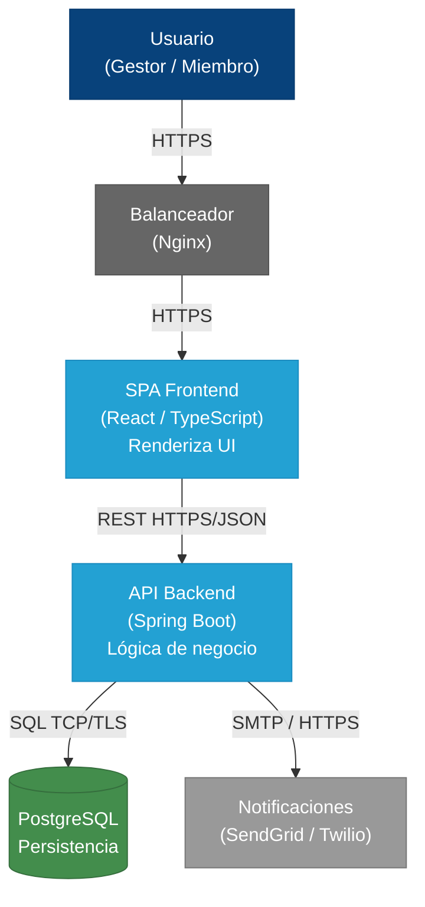
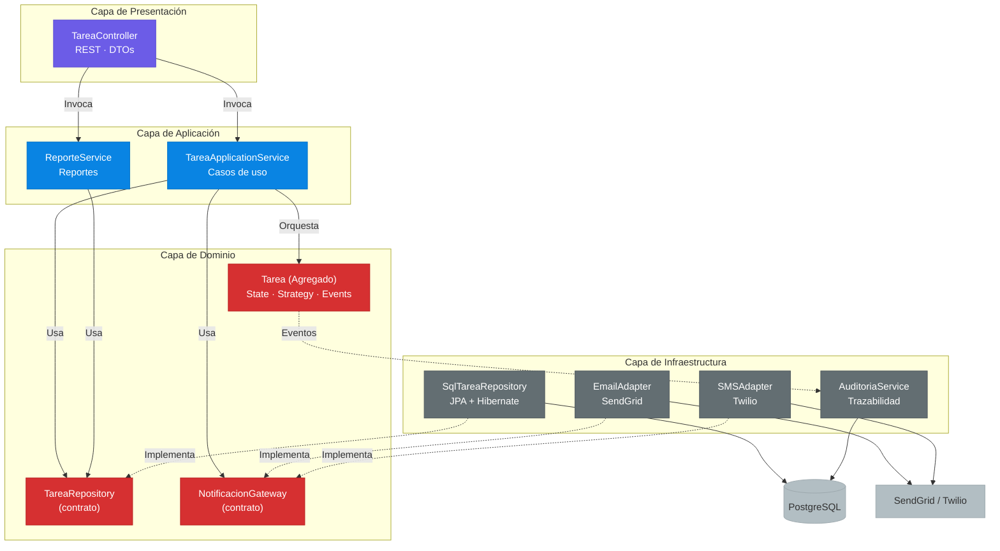
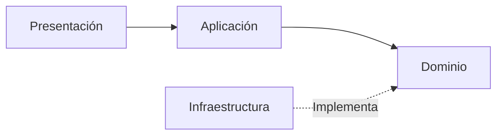

Agenda
======

- Escenario y ADR 001 — Justificación
- C4 Nivel 2 — Diagrama de Contenedores
- C4 Nivel 3 — Diagrama de Componentes
- Función de cada capa (4 capas lógicas)
- Flujo de ejemplo: cambio de estado
- Resumen y patrones aplicados

<!--
speaker_note: |
  Bienvenidos. Hoy presentamos la arquitectura en capas distribuidas para el Sistema de Tareas.
  La agenda cubre el ADR con la decisión justificada, los diagramas C4 de contenedores y componentes, la explicación detallada de cada capa y un flujo de ejemplo que las conecta todas.
  Vamos paso a paso, empezando por el contexto del sistema.
-->

<!-- end_slide -->

Escenario y Requerimientos
==========================

- Plataforma de gestión de trabajo para equipos distribuidos
- **100 a 10,000 usuarios concurrentes**
- CRUD de tareas con ciclo de vida por estados
- Notificaciones por email y SMS
- Reportes agregados de productividad
- Requerimientos no funcionales:
  - Consultas < 200ms
  - Alta disponibilidad en horario laboral
  - Separación de responsabilidades por área operativa

<!--
speaker_note: |
  El Sistema de Tareas es una plataforma para una empresa mediana con equipos distribuidos geográficamente.
  Los requerimientos clave son: soportar de 100 a 10,000 usuarios concurrentes, gestionar tareas con su ciclo de vida completo, notificar cambios por correo y SMS, y generar reportes de productividad.
  A nivel no funcional, necesitamos consultas rápidas, alta disponibilidad y separación clara de roles entre frontend, backend y base de datos.
-->

<!-- end_slide -->

ADR 001 — Decisión
==================

**Arquitectura en capas distribuidas (N-tier) con 3 tiers físicos:**

1. **Tier de Presentación** — SPA React + Nginx (expuesto a internet)
2. **Tier de Aplicación + Dominio** — API Spring Boot (subred protegida)
3. **Tier de Infraestructura** — PostgreSQL + servicios externos (subred de datos)

Comunicación entre tiers: **REST (HTTP/JSON)**

Dependencias internas: regla **DIP** — siempre hacia el Dominio

<!--
speaker_note: |
  La decisión fue una arquitectura de 3 tiers físicos.
  El tier de presentación es una SPA en React servida por Nginx, expuesta a internet.
  El tier de aplicación contiene la lógica de negocio en Spring Boot, en una subred protegida.
  El tier de infraestructura aísla PostgreSQL y los servicios de notificación externos.
  La comunicación entre tiers usa REST con HTTP/JSON, y a nivel interno seguimos DIP: todas las dependencias apuntan hacia el dominio, nunca al revés.
-->

<!-- end_slide -->

Alternativas Consideradas
==========================

<!-- column_layout: [1, 1] -->

<!-- column: 0 -->

**Monolito en Capas**

- Simplicidad operativa
- Transacciones directas
- Un solo despliegue
Descartado:
- No escala frontend/backend por separado
- Sin aislamiento DMZ

<!-- column: 1 -->

**Microservicios**

- Escalado granular
- Despliegue independiente
- Equipos autónomos
Descartado:
- Sobre-ingeniería para dominio acotado
- Complejidad operativa injustificada

<!-- reset_layout -->

<!--
speaker_note: |
  Evaluamos dos alternativas antes de decidirnos por capas distribuidas.
  El monolito en capas ofrecía simplicidad y transacciones directas, pero un único despliegue impedía escalar el frontend independientemente y no permitía el aislamiento de seguridad por zonas de red que requería la organización.
  Los microservicios daban escalado granular y equipos autónomos, pero para un equipo mediano con un dominio de tareas acotado, la complejidad operativa de orquestar contenedores, manejar consistencia distribuida y configurar observabilidad era sobre-ingeniería.
-->

<!-- end_slide -->

ADR — Consecuencias
===================

**Impacto positivo:**
- Escalado independiente del frontend
- Seguridad por zona (DMZ)
- Mantenibilidad por equipo (frontend, backend, DBA)
- Separación clara de responsabilidades

**Impacto negativo:**
- Latencia de red entre tiers
- Fallos parciales (requiere reintentos)
- Complejidad operativa (3 superficies de monitoreo)

> Trade-off aceptado: la ganancia en escalabilidad, seguridad y organización de equipos justifica el costo en latencia y complejidad.

<!--
speaker_note: |
  Toda decisión arquitectónica tiene consecuencias.
  Del lado positivo: podemos escalar el frontend horizontalmente sin tocar el backend, tenemos aislamiento de seguridad por zonas de red, cada equipo mantiene su tier sin interferencias y las responsabilidades están claramente separadas.
  Del lado negativo: cada salto de red introduce latencia, los fallos parciales requieren manejo de errores en cada capa, y ahora tenemos tres superficies para monitorear y desplegar.
  El trade-off se acepta porque la ganancia en escalabilidad, seguridad y organización supera estos costos para nuestro contexto.
-->

<!-- end_slide -->

C4 Nivel 2 — Diagrama de Contenedores
=====================================

<!--
speaker_note: |
  Este es el diagrama C4 Nivel 2 de contenedores. Muestra los tres tiers físicos y las tecnologías seleccionadas.
  El usuario accede por HTTPS a través de un balanceador Nginx. El frontend es una SPA en React que consume la API REST del backend.
  El backend en Spring Boot orquesta la lógica de negocio y se comunica con PostgreSQL para persistencia y con servicios externos de notificación como SendGrid y Twilio.
  Noten la separación física: el frontend está expuesto, el backend en subred protegida, y la base de datos en la subred más restringida.
-->

<!-- end_slide -->

C4 Nivel 3 — Componentes del Backend
====================================

<!--
speaker_note: |
  Este es el C4 Nivel 3 simplificado. Muestra las 4 capas lógicas dentro del backend.
  La Presentación expone el TareaController con endpoints REST y DTOs.
  La Aplicación coordina los casos de uso con TareaApplicationService y ReporteService.
  El Dominio contiene la entidad Tarea con sus patrones State y Strategy, y define los contratos TareaRepository y NotificacionGateway.
  La Infraestructura implementa esos contratos: SqlTareaRepository con JPA, EmailAdapter con SendGrid, SMSAdapter con Twilio, y AuditoriaService escuchando eventos.
  Las líneas punteadas muestran DIP: la infraestructura implementa interfaces definidas por el dominio.
-->

<!-- end_slide -->

Dirección de Dependencias (DIP)
===============================

> Las dependencias siempre apuntan hacia el Dominio.
> La Infraestructura implementa contratos definidos por el Dominio.
> El Dominio no conoce frameworks, ORMs ni proveedores externos.

<!--
speaker_note: |
  Este diagrama resume la dirección de dependencias según el principio DIP.
  Presentación depende de Aplicación, Aplicación depende de Dominio. El Dominio no depende de nadie.
  Infraestructura implementa contratos definidos por el Dominio, invirtiendo la dependencia tradicional.
  Esto significa que el Dominio —el núcleo del sistema— no sabe nada de Spring, Hibernate, SendGrid ni Twilio. Es completamente portable.
-->

<!-- end_slide -->

Capa de Presentación
====================

**Responsabilidad:** Traducir protocolos y experiencia de usuario.
No decide reglas de negocio.

**Componentes:**
- `TareaController` — Endpoints REST
  - `GET /tareas`, `POST /tareas`, `PATCH /tareas/{id}/estado`
  - Recibe DTOs, valida formato, delega al servicio de aplicación

**Patrones aplicados:**
- **Front Controller** — DispatcherServlet de Spring
- **DTO / ViewModel** — `TareaRequest`, `TareaResponse`

**Lo que NO hace:**
No contiene lógica de negocio, no accede a la BD, no decide transiciones de estado.

<!--
speaker_note: |
  Empecemos con la capa de Presentación. Su única responsabilidad es traducir entre protocolos externos y los casos de uso internos.
  El TareaController expone los endpoints REST y recibe DTOs de entrada. Valida el formato pero no decide nada de negocio.
  Usa el patrón Front Controller de Spring y DTOs para el transporte de datos.
  Es importante entender lo que NO hace: nunca contiene lógica de negocio, nunca accede directamente a la base de datos y nunca decide si una tarea puede cambiar de estado. Todo eso lo delega hacia abajo.
-->

<!-- end_slide -->

Capa de Aplicación
==================

**Responsabilidad:** Coordinar los pasos de cada caso de uso.
Orquesta, no contiene lógica de negocio.

**Componentes:**
- `TareaApplicationService`
  - Carga la entidad desde el repositorio
  - Resuelve la estrategia de asignación
  - Delega el cambio de estado al dominio
  - Persiste y dispara notificaciones
- `ReporteService` — Consultas agregadas

**Patrones aplicados:**
- **Use Case / Application Service**
- **Facade** — API cohesiva hacia presentación

<!--
speaker_note: |
  La capa de Aplicación es la directora de orquesta. No toca instrumentos, solo coordina.
  El TareaApplicationService ejecuta el flujo completo de un caso de uso: carga la tarea, resuelve políticas, delega al dominio, persiste y notifica. Pero en ningún momento contiene reglas de negocio.
  El ReporteService coordina consultas agregadas usando el repositorio.
  Los patrones clave son Application Service —cada método es un caso de uso— y Facade para ofrecer una API simple a la capa de presentación.
-->

<!-- end_slide -->

Capa de Dominio — Reglas de Negocio
===================================

**Responsabilidad:** Contener la política y las reglas de negocio.
Es el núcleo del sistema. No depende de nada externo.

**Componentes principales:**

- **`Tarea`** — Agregado raíz
  - Encapsula ciclo de vida: Pendiente → EnProgreso → Completada/Cancelada
  - Contiene: título, descripción, prioridad, fecha límite, responsable, estado

- **`EstadoTarea`** — State Pattern
  - Pendiente → EnProgreso o Cancelada
  - EnProgreso → Completada o Cancelada
  - Completada y Cancelada → estados terminales

- **`TareaEventoDominio`** — Domain Events
  - `TareaCreada`, `TareaAsignada`, `TareaCompletada`

<!--
speaker_note: |
  Llegamos al corazón del sistema: la capa de Dominio.
  La entidad Tarea es el agregado raíz que garantiza la consistencia de sus reglas internas. Encapsula todo el ciclo de vida.
  El patrón State se usa para modelar las transiciones: Pendiente solo puede pasar a EnProgreso o Cancelada, EnProgreso solo a Completada o Cancelada, y los estados terminales no permiten más cambios.
  Los eventos de dominio como TareaCreada o TareaCompletada permiten que la infraestructura reaccione sin que el dominio sepa quién está escuchando.
-->

<!-- end_slide -->

Capa de Dominio — Patrones
==========================

- **Aggregate (DDD):** `Tarea` es raíz, garantiza consistencia interna
- **State:** Cada estado es una clase; `Tarea` delega transiciones
- **Strategy:** `AsignacionPolicy` — ¿quién puede asignar?
  - Líder: asigna a cualquier miembro
  - Miembro: solo auto-asignarse tareas libres
- **Strategy:** `SLAStrategy` — prioridad dinámica por tiempo restante
- **Domain Events:** Desacoplan reacciones del flujo principal
- **Interfaces (contratos):** `TareaRepository`, `NotificacionGateway`
  - Definidas aquí, implementadas en infraestructura

<!--
speaker_note: |
  Veamos los patrones que hacen potente a esta capa.
  Aggregate de DDD: Tarea es la raíz que protege las reglas de consistencia.
  State: cada estado es una clase separada que implementa una interfaz común; la entidad solo delega.
  Strategy para asignación: un líder puede asignar a cualquiera, un miembro solo puede auto-asignarse. Esta política es intercambiable sin modificar la entidad.
  Strategy para SLA: la prioridad se calcula dinámicamente según el tiempo restante; si faltan menos de 2 horas, la tarea sube a crítica.
  Domain Events permiten que la auditoría y las notificaciones reaccionen sin acoplar el dominio.
  Y lo más importante: los contratos TareaRepository y NotificacionGateway se definen aquí, en el dominio. La infraestructura los implementa, nunca al revés.
-->

<!-- end_slide -->

Capa de Infraestructura
=======================

**Responsabilidad:** Implementar persistencia e integraciones externas.
Interactúa con el mundo exterior.

**Componentes:**

- **`SqlTareaRepository`** — JPA + Hibernate → PostgreSQL
  Implementa `TareaRepository` (contrato del dominio)

- **`EmailAdapter`** — SendGrid (SMTP/API)
  Implementa `NotificacionGateway`

- **`SMSAdapter`** — Twilio (API REST)
  Implementa `NotificacionGateway`

- **`AuditoriaService`** — Escucha eventos de dominio
  Registra trazabilidad de cambios en tabla `auditoria_tareas`

**Patrones aplicados:**
Repository, Data Mapper (ORM), Adapter/Gateway, Event Listener

<!--
speaker_note: |
  La capa de Infraestructura es la que interactúa con el mundo real.
  SqlTareaRepository implementa el contrato definido en el dominio usando JPA y Hibernate, mapeando entidades a tablas en PostgreSQL.
  EmailAdapter y SMSAdapter implementan NotificacionGateway, cada uno traduciendo la interfaz del dominio a la API propietaria de su proveedor. Esto permite cambiar de SendGrid a otro proveedor sin tocar el dominio.
  AuditoriaService escucha los eventos de dominio y registra cada cambio con marca de tiempo, usuario y detalle, sin bloquear el flujo principal.
  Los patrones aquí son puramente técnicos: Repository, Data Mapper, Adapter y Event Listener.
-->

<!-- end_slide -->

Flujo de Ejemplo — Cambio de Estado
===================================

`PATCH /tareas/42/estado` → marcar como COMPLETADA

**Paso 1 — Presentación:** `TareaController` recibe la petición, valida el DTO, invoca al servicio.

**Paso 2 — Aplicación:** `TareaApplicationService` carga la `Tarea` desde el repositorio.

**Paso 3 — Dominio:** `Tarea` delega en `EstadoEnProgreso.completar()`. Valida la transición, muta a `Completada`, emite `TareaCompletadaEvent`.

**Paso 4 — Aplicación:** Persiste con `TareaRepository.save(tarea)`.

**Paso 5 — Infraestructura:** `SqlTareaRepository` ejecuta `UPDATE tareas SET estado = 'COMPLETADA' WHERE id = 42`.

**Paso 6 — Aplicación:** Notifica: `NotificacionGateway.notificarCambioEstado(tarea)`.

**Paso 7 — Infraestructura:** `EmailAdapter` envía el correo vía SendGrid.

**Paso 8 — Infraestructura (async):** `AuditoriaService` recibe el evento y registra auditoría.

<!--
speaker_note: |
  Veamos cómo colaboran las cuatro capas en un caso de uso concreto: marcar una tarea como completada.
  El controlador recibe el PATCH, valida y delega. El servicio de aplicación carga la entidad y la orquesta.
  El dominio valida la transición —si el estado actual es EnProgreso, puede pasar a Completada—, muta el estado y emite el evento de dominio.
  La aplicación persiste el cambio y dispara la notificación.
  La infraestructura ejecuta el UPDATE en PostgreSQL, envía el correo por SendGrid, y de forma asíncrona el AuditoriaService registra la trazabilidad al recibir el evento.
  Todo esto ocurre sin que el dominio sepa nada de HTTP, SQL, SMTP ni frameworks.
-->

<!-- end_slide -->

Resumen de Capas
================

- **Presentación** — Traduce HTTP/UI
  Patrones: Front Controller, DTO
  → Depende de Aplicación

- **Aplicación** — Coordina casos de uso
  Patrones: Use Case, Facade
  → Depende de Dominio (contratos)

- **Dominio** — Contiene reglas de negocio
  Patrones: Aggregate, State, Strategy, Domain Events
  → No depende de nada externo

- **Infraestructura** — Implementa persistencia e integraciones
  Patrones: Repository, Adapter, ORM
  → Implementa contratos del Dominio

> **DIP:** Presentación → Aplicación → Dominio ← Infraestructura

<!--
speaker_note: |
  Para cerrar, este es el resumen de las cuatro capas.
  Presentación traduce protocolos, Aplicación coordina casos de uso, Dominio contiene las reglas de negocio, Infraestructura implementa los detalles técnicos.
  Cada capa tiene sus patrones específicos y responsabilidades claras.
  Y la regla de oro: las dependencias siempre apuntan hacia el Dominio. El Dominio es el centro inmutable del sistema. Todo lo demás es un detalle que puede cambiar.
-->
