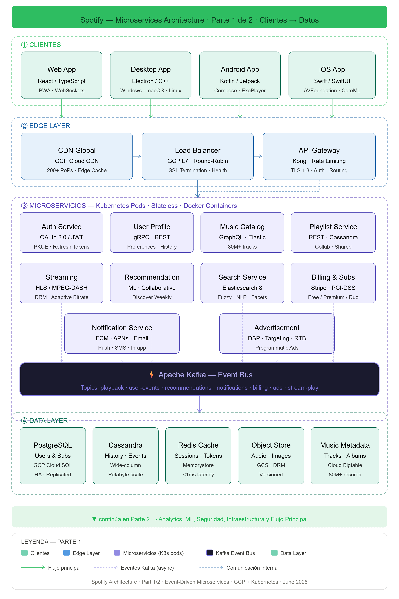
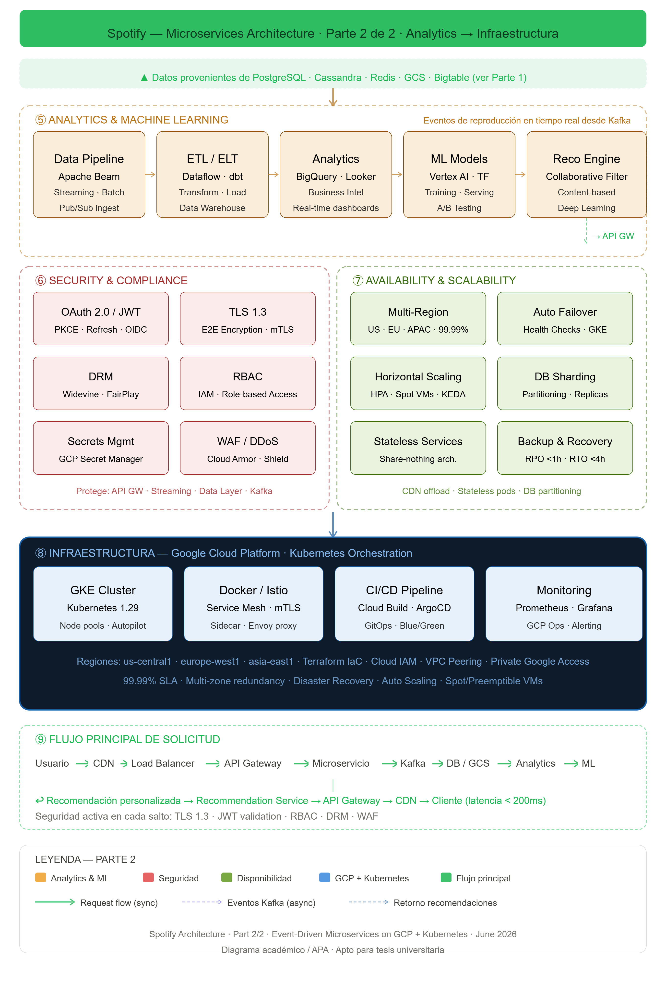

\thispagestyle{empty}
\begin{center}
\includegraphics[width=4cm]{img/LogoCenfotec200x200.png}\\[1cm]
{\LARGE \textbf{Spotify}}\\[0.5cm]
{\Large Investigación de Arquitectura de Software y Rol del Arquitecto}\\[1.5cm]
{\large \textbf{Universidad CENFOTEC}}\\[0.3cm]
{\large Curso: Arquitectura del Software}\\[1cm]
{\large \textbf{Estudiantes}}\\[0.3cm]
Daniel Alberto Serrano Mora\\
Andrés Jose Westra Ureña\\
Carlos Andres Fuentes Santos\\
Erick Andre Campos Sibaja\\
Michael Ramírez González\\[1cm]
{\large \textbf{Profesor}}\\[0.3cm]
Dennis Alberto Córdoba López\\[1.5cm]
{\large 24 de junio, 2026}
\end{center}
\newpage

\tableofcontents
\newpage

# Plataforma asignada: Spotify

# Introducción

El presente trabajo tiene como objetivo analizar la arquitectura de software de Spotify, una de las plataformas de streaming de audio más grandes del mundo, con más de 600 millones de usuarios activos mensuales y un catálogo que supera los 100 millones de pistas. A lo largo de este documento se examinan los componentes técnicos que sostienen la plataforma, las decisiones arquitectónicas que han permitido su crecimiento y las tecnologías que la hacen posible.

El análisis se estructura en tres secciones principales. La primera aborda la arquitectura actual de Spotify: su modelo de microservicios con enfoque event-driven, las tecnologías empleadas, los mecanismos de manejo de datos, seguridad, escalabilidad y disponibilidad, así como un análisis detallado de las decisiones arquitectónicas clave que han guiado la evolución del sistema. La segunda sección investiga el estado actual del rol del arquitecto de software mediante la comparación de perfiles reales del mercado laboral, incluyendo un puesto en el propio Spotify. Finalmente, la tercera sección proyecta la evolución del rol del arquitecto en la próxima década, considerando el impacto de la inteligencia artificial, la computación cuántica y las nuevas responsabilidades que deberá asumir este profesional.

La elección de Spotify como caso de estudio responde a que representa un ejemplo paradigmático de cómo una arquitectura de software bien diseñada puede habilitar la innovación continua, la escalabilidad global y la autonomía de cientos de equipos de desarrollo, al tiempo que se mantienen niveles exigentes de disponibilidad y rendimiento.

# Sección 1: Investigación de arquitectura.

## Tipo de Arquitectura

Spotify opera bajo una arquitectura de microservicios con modelo event-driven, desplegada íntegramente sobre Google Cloud Platform. La comunicación entre los aproximadamente 1.500 servicios se resuelve mediante canales síncronos —REST y gRPC— y asíncronos —Apache Kafka como backbone principal, complementado por Google Pub/Sub—. Esta estructura es gestionada por más de 250 equipos autónomos denominados squads, cada uno responsable del ciclo de vida completo de sus servicios bajo el principio "You build it, you run it" (Kniberg e Ivarsson, 2012).

La alineación entre la organización de ingeniería y la arquitectura técnica es una manifestación directa de la Ley de Conway: el diseño del sistema refleja la estructura de comunicación de la organización que lo construye.

### Patrones arquitectónicos identificados:

* **Microservicios**: ~1.500 servicios independientes, cada uno con despliegue y base de datos propios.  
* **Event-Driven Architecture:** Apache Kafka procesa billones de eventos diarios; los servicios se comunican publicando y consumiendo eventos.  
* **Backend for Frontend**: APIs especializadas por tipo de cliente: iOS, Android, web, desktop, parlantes, automóviles.
* **API Gateway**: Apollo GraphQL como punto de entrada unificado para todos los clientes.  
* **Strangler Fig:** Migración progresiva desde el monolito: nuevas funcionalidades como microservicios, redirigiendo tráfico incrementalmente.  
* **Saga / Coreografía**: Transacciones distribuidas coordinadas mediante eventos, sin orquestador central.  
* **CQRS**: Separación de modelos de lectura y escritura en servicios de alta demanda como catálogo y playlists.  
* **CDN / Edge Delivery**: Distribución global de contenido con múltiples proveedores y puntos de presencia propios.

## Tecnologías Principales

El ecosistema tecnológico de Spotify es notablemente poliglota: cada capa del sistema emplea las herramientas más adecuadas para su caso de uso específico, priorizando escalabilidad, latencia y productividad de los equipos.

**Lenguajes.** Java, con Spring Boot, es el lenguaje predominante en el backend: la mayoría de los microservicios core están implementados en él. Python, el lenguaje del monolito original, se utiliza hoy en pipelines de machine learning, ciencia de datos y automatización. C++ gestiona los componentes de menor latencia, como el motor de streaming y los reproductores nativos para escritorio y móviles. TypeScript y JavaScript cubren el frontend web y servicios ligeros con Node.js. Scala, mediante Scio —un wrapper de Apache Beam desarrollado internamente—, procesa los pipelines de datos a gran escala.

**Frameworks y herramientas internas.** Apollo GraphQL funciona como API Gateway unificado. gRPC y Protocol Buffers se emplean para la comunicación interna de alta eficiencia, reemplazando REST en las rutas más exigentes. Luigi y Styx orquestan batch jobs y workflows de datos. ABBA es la plataforma interna de experimentación A/B que permite evaluar hipótesis de producto en cientos de millones de usuarios simultáneamente. Backstage, el portal de desarrolladores creado por Spotify y donado a la Cloud Native Computing Foundation en 2020, centraliza el catálogo de servicios, genera documentación viva desde el código y ofrece plantillas de scaffolding que redujeron el onboarding de nuevos ingenieros de semanas a horas.

**Infraestructura cloud.** Entre 2016 y 2018, Spotify migró desde sus datacenters propios —aproximadamente 5.000 servidores físicos— hacia Google Cloud Platform, en una de las migraciones a la nube más significativas de la industria . Hoy la plataforma opera sobre Kubernetes (Google Kubernetes Engine), con Docker como estándar de empaquetado, una CDN multi-proveedor con puntos de presencia propios, y CI/CD basado en Jenkins y Spinnaker.

**Almacenamiento y mensajería**. La estrategia de almacenamiento es poliglota: Apache Cassandra (~3.000 nodos) aloja los metadatos del catálogo —canciones, álbumes, artistas, playlists— por su escalabilidad horizontal, arquitectura masterless y replicación multirregión . PostgreSQL gestiona datos relacionales como usuarios, cuentas y facturación. BigTable almacena métricas de streaming y eventos analíticos. Redis y Memcached proporcionan una capa de caché distribuida esencial para mantener latencias inferiores a 200 ms en la reproducción. Elasticsearch indexa el catálogo para búsqueda full-text. Google Cloud Storage aloja los archivos de audio en escala de petabytes. BigQuery funciona como data warehouse para analítica. En el plano de mensajería, Apache Kafka constituye el sistema nervioso de la plataforma, procesando más de un billón de eventos al día, complementado por Google Pub/Sub para integraciones nativas con GCP.

**Observabilidad.** Prometheus y Grafana gestionan métricas y alertas. Google Cloud Operations centraliza logs y monitoreo de infraestructura. Herramientas internas como Heroic y Ffwd, liberadas como open source, manejan series temporales a la escala de Spotify.

## Componentes de la Solución

La funcionalidad de Spotify se articula en ocho dominios de servicios core que colaboran para ofrecer la experiencia del producto. Algunas responsabilidades que lo sostienen:

**Catálogo musical**. Con más de 100 millones de pistas, el catálogo es el activo central de la plataforma. El Metadata Service, construido sobre Cassandra, almacena y sirve información estructurada de canciones, álbumes, artistas y géneros. El Audio Features Pipeline extrae características acústicas —tempo, tonalidad, energía, bailabilidad— mediante modelos de machine learning. El Search Service indexa el contenido con Elasticsearch para búsquedas por título, artista, álbum o letra. El Cover Art Service gestiona carátulas e imágenes asociadas.

**Motor de recomendaciones**. Es el diferenciador competitivo más importante de Spotify. BaRT (Bandits for Recommendations as Treatments) utiliza algoritmos de bandits multi-armados para balancear explotación —recomendar lo que el usuario ya prefiere— y exploración —descubrir contenido nuevo— en la página principal. Discover Weekly genera cada lunes una playlist personalizada combinando filtrado colaborativo con procesamiento de lenguaje natural sobre textos que los usuarios escriben acerca de canciones en blogs, redes y foros . Release Radar recomienda lanzamientos recientes de artistas que el usuario sigue. Daily Mix agrupa canciones por estilo con inserción ocasional de descubrimiento. El Taste Profile representa las preferencias del usuario como un vector denso generado por redes neuronales profundas. El enfoque Algotorial combina curaduría editorial humana con señales algorítmicas. DJ AI, lanzado en 2023, utiliza inteligencia artificial generativa y voz sintética para actuar como un curador personalizado que selecciona y comenta canciones.

**Streaming de audio**. El Audio Delivery Pipeline codifica en VBR (variable bitrate) usando los códecs OGG Vorbis y AAC, adaptando dinámicamente la tasa a las condiciones de red del usuario (Kreitz y Niemelä, 2010). El Playback Service gestiona sesiones y colas de reproducción. Spotify Connect sincroniza el estado entre dispositivos —teléfono, computadora, parlante, televisión, automóvil—. El Offline Service administra descargas con almacenamiento local cifrado y verificación periódica de licencias.

**Publicidad**. Spotify opera un marketplace publicitario para su nivel gratuito. El Ad Insertion Service inserta anuncios dinámicamente en el flujo de audio. El Ad Targeting Engine segmenta audiencias por demografía, comportamiento de escucha y dispositivo. El Ad Marketplace gestiona subasta en tiempo real para el inventario. Ad Analytics mide impresiones, tasa de finalización y atribución de conversiones.

**Social y playlists**. El Playlist Service gestiona la creación, edición, compartición y colaboración en tiempo real de playlists. El Social Graph administra las relaciones de seguimiento entre usuarios, artistas y curadores. El Activity Feed muestra la actividad reciente de los contactos. Las Collaborative Playlists implementan CRDT (Conflict-free Replicated Data Types) para permitir edición simultánea por múltiples usuarios sin necesidad de un servidor central de coordinación.

**Autenticación y usuarios**. El Auth Service implementa OAuth 2.0, Single Sign-On y autenticación mediante proveedores sociales. El Account Service gestiona los planes de suscripción —Free, Premium Individual, Duo, Family, Student— con lógica de negocio diferenciada por país y moneda. El Payment Service integra pasarelas de pago, facturación recurrente y cumplimiento fiscal por jurisdicción.

Plataforma de datos. Spotify ingiere aproximadamente un billón de eventos al día: reproducciones, búsquedas, interacciones de interfaz y señales de aplicación. Los pipelines de ETL utilizan Scio (Scala \+ Apache Beam) sobre Google Dataflow. El Feature Store centraliza las características utilizadas para entrenar y servir modelos de machine learning. La plataforma ABBA permite ejecutar experimentos A/B a escala de cientos de millones de usuarios simultáneamente, constituyendo una de las infraestructuras de experimentación más grandes del mundo.

**Content platform.** El Ingestion Pipeline recibe contenido automatizado de sellos discográficos y distribuidores digitales. Las herramientas Spotify for Artists, Spotify for Labels y Spotify for Podcasters constituyen los portales de gestión para creadores. El Rights Management gestiona derechos de autor, licencias y el cálculo y la liquidación de regalías a titulares de derechos.

## Evolución Histórica

La arquitectura de Spotify ha transitado por cinco fases diferenciadas, cada una impulsada por necesidades concretas de escala y madurez organizacional.

**Fase 1 — Monolito (2006-2012)**. Backend en Python/Django y motor de streaming en C++. PostgreSQL como base de datos única. Infraestructura en datacenters propios (~5.000 servidores). Hacia el final de esta fase, la base de datos relacional se satura ante el crecimiento del catálogo y de la base de usuarios (Kreitz y Niemelä, 2010).

**Fase 2 — SOA incipiente (2012-2015).** Primeros servicios extraídos del monolito. Cassandra reemplaza a PostgreSQL en el catálogo. Se adopta Kafka para mensajería asíncrona y Docker para contenedorización. Se publica el modelo de squads autónomos (Kniberg e Ivarsson, 2012).

**Fase 3 — Cloud \+ microservicios (2016-2018).** Migración integral a Google Cloud Platform. La arquitectura crece hasta ~1.500 microservicios. El sistema de orquestación Helios cede paso a Kubernetes (GKE). El monolito se reduce progresivamente mediante el patrón Strangler Fig.

**Fase 4 — Madurez (2018-2020).** Cierre del último datacenter propio. Apollo GraphQL se consolida como API Gateway. gRPC reemplaza REST en las rutas internas críticas. Backstage se libera como open source y se dona a la CNCF. El machine learning alcanza escala industrial.

**Fase 5 — Expansión e IA (2021-presente)**. Scio se consolida como el estándar de procesamiento de datos. Expansión a podcast, audiolibros y video. Lanzamiento de DJ AI con IA generativa. La arquitectura event-driven supera el billón de eventos diarios. Compromisos de sostenibilidad y exploración de edge computing.

## Manejo de datos

Spotify procesa diariamente enormes cantidades de información provenientes de cientos de millones de usuarios alrededor del mundo. Para administrar eficientemente este volumen de datos, la plataforma emplea una arquitectura distribuida basada en diferentes tecnologías de almacenamiento y procesamiento, donde cada componente se especializa en un tipo específico de información (Spotify Engineering, 2024).

### Almacenamiento de datos

Spotify utiliza diferentes motores de bases de datos según las características de la información que administra.

Las bases de datos relacionales, como PostgreSQL, almacenan información estructurada relacionada con perfiles de usuario, cuentas, suscripciones y configuraciones del sistema (Google Cloud, 2024).

Por otro lado, bases de datos distribuidas como Apache Cassandra permiten gestionar grandes volúmenes de información con alta disponibilidad y baja latencia, incluyendo historiales de reproducción, eventos generados por los usuarios y datos utilizados por los sistemas de recomendación (Apache Cassandra, 2024).

### Procesamiento de datos

El procesamiento de información se realiza mediante una arquitectura orientada a eventos utilizando Apache Kafka. Cada interacción realizada por un usuario genera eventos que son enviados a diferentes servicios consumidores para alimentar sistemas analíticos, motores de recomendaciones y procesos de aprendizaje automático (Apache Kafka, 2024).

Este enfoque permite procesar información prácticamente en tiempo real sin afectar la experiencia del usuario y facilita el desacoplamiento entre los diferentes microservicios que conforman la plataforma (Spotify Engineering, 2024).

### Catálogo musical

El catálogo musical de Spotify contiene millones de canciones, podcasts y audiolibros distribuidos globalmente. Cada elemento almacena metadatos como título, artista, álbum, género musical, duración, licencias de distribución y restricciones geográficas, permitiendo búsquedas rápidas y recomendaciones personalizadas (Spotify, 2024).

### Playlists

Las playlists representan uno de los elementos principales de la plataforma. Estas pueden ser creadas por usuarios, compartidas de manera colaborativa o generadas automáticamente mediante algoritmos de inteligencia artificial que analizan los hábitos de escucha y las preferencias musicales de cada usuario (Spotify Engineering, 2024).

### Datos de usuario

Spotify recopila diferentes tipos de información para personalizar la experiencia del usuario, incluyendo historial de reproducción, canciones favoritas, tiempo de escucha, dispositivos utilizados e interacciones dentro de la aplicación. Estos datos son procesados mediante modelos de Machine Learning que permiten generar recomendaciones altamente personalizadas (Spotify Engineering, 2024).

## Seguridad

La seguridad constituye uno de los pilares fundamentales de la arquitectura de Spotify. La plataforma implementa mecanismos de autenticación, autorización, cifrado y protección del contenido para garantizar tanto la privacidad de los usuarios como el cumplimiento de los acuerdos de distribución con la industria musical (Spotify Engineering, 2024).

### Autenticación

Spotify utiliza el protocolo OAuth 2.0 para autenticar usuarios y aplicaciones de terceros. Este mecanismo permite el uso de tokens temporales de acceso, reduciendo la exposición de credenciales y aumentando la seguridad de la plataforma (Internet Engineering Task Force, 2012).

### Autorización

La autorización se implementa mediante políticas de control de acceso que restringen las operaciones permitidas para cada usuario, servicio o aplicación. Los distintos microservicios únicamente acceden a la información necesaria para cumplir sus funciones, siguiendo el principio de mínimo privilegio (Google Cloud, 2024).

### Encriptación

Toda la comunicación entre clientes y servidores utiliza protocolos HTTPS con TLS para proteger la información durante la transmisión. Asimismo, los datos almacenados son cifrados utilizando algoritmos modernos como AES-256, reduciendo el riesgo de accesos no autorizados en caso de incidentes de seguridad (Google Cloud, 2024).

### Protección del contenido (DRM)

Para proteger los derechos de autor, Spotify implementa tecnologías de Digital Rights Management (DRM), las cuales limitan la reproducción del contenido a usuarios autorizados mediante licencias digitales, tokens de acceso y restricciones geográficas establecidas por los propietarios del contenido (Spotify, 2024).

## Escalabilidad

Spotify presta servicio a más de 600 millones de usuarios activos mensuales distribuidos alrededor del mundo. Para soportar esta demanda, la plataforma utiliza una arquitectura de microservicios desplegada sobre Kubernetes, permitiendo escalar cada componente de manera independiente según la carga de trabajo (Spotify, 2024).

El uso de Kubernetes facilita el autoescalado de contenedores, el balanceo de carga y la recuperación automática de servicios, permitiendo que la infraestructura responda dinámicamente ante incrementos repentinos del tráfico (Kubernetes Documentation, 2024).

Adicionalmente, Spotify utiliza redes de distribución de contenido (CDN) para almacenar copias del contenido multimedia en servidores cercanos a los usuarios, reduciendo significativamente la latencia y mejorando la velocidad de reproducción (Google Cloud, 2024).

Otra estrategia importante consiste en el particionado o *sharding* de bases de datos, donde la información se divide utilizando criterios como el identificador del usuario o la región geográfica. Este enfoque distribuye la carga entre múltiples servidores y evita cuellos de botella conforme aumenta el volumen de información (Apache Cassandra, 2024).

## Disponibilidad

Spotify implementa diversas estrategias para garantizar la disponibilidad continua del servicio incluso ante fallos de infraestructura o incrementos inesperados en la demanda (Spotify Engineering, 2024).

Entre estas estrategias destaca la replicación de datos en múltiples centros de datos distribuidos geográficamente, permitiendo mantener la continuidad del servicio ante la pérdida de un nodo o una región completa (Google Cloud, 2024).

Asimismo, Kubernetes supervisa continuamente el estado de los microservicios y reinicia automáticamente aquellos que presentan fallos, contribuyendo a mantener altos niveles de disponibilidad (Kubernetes Documentation, 2024).

Como parte de su estrategia de recuperación ante desastres, Spotify realiza respaldos periódicos, replicación geográfica y monitoreo continuo mediante herramientas de observabilidad como Prometheus y Grafana, permitiendo detectar incidentes rápidamente y reducir los tiempos de recuperación (Spotify Engineering, 2024).

\newpage

## Diagrama de arquitectura

{width=80%}

\newpage

{width=80%}

## Decisiones Arquitectónicas Clave

Las decisiones que dieron forma a la arquitectura actual de Spotify pueden analizarse siguiendo el formato de Architecture Decision Records, que documenta el contexto, la decisión tomada, su justificación y las contrapartidas asumidas.

**ADR-1 — De monolito a microservicios**. Hacia 2012, el monolito Python/Django se había convertido en un cuello de botella organizacional: un solo codebase impedía que múltiples equipos desplegaran de forma independiente. La decisión de descomponerlo en microservicios permitió que más de 250 squads desarrollaran y desplegaran en paralelo, acortando el tiempo de salida al mercado y aislando fallos (Newman, 2021). La contrapartida fue una complejidad operativa significativa en orquestación, service discovery y consistencia eventual, que Spotify gestionó construyendo herramientas como Backstage.

**ADR-2 — Google Cloud Platform.** Mantener datacenters propios con aproximadamente 5.000 servidores físicos desviaba talento de ingeniería hacia tareas de infraestructura de bajo valor añadido. La migración a GCP, completada en aproximadamente dos años, permitió reducir el costo total de propiedad y acceder a servicios managed de análisis como BigQuery y Dataflow. A cambio, Spotify asumió dependencia de un solo proveedor cloud y el riesgo técnico de mover petabytes de datos sin interrumpir el servicio.

**ADR-3 — Apache Cassandra para el catálogo.** PostgreSQL, la base de datos relacional original, ofrecía consistencia fuerte pero no escalaba horizontalmente al ritmo de crecimiento del catálogo. Cassandra aportó escalabilidad horizontal sin punto único de fallo, arquitectura masterless, replicación multirregión y latencia predecible . La contrapartida fue la adopción de un modelo de consistencia eventual que obligó a desnormalizar datos y manejar la consistencia a nivel de aplicación.

**ADR-4 — Apache Kafka como sistema nervioso.** Con cientos de microservicios, la comunicación punto a punto se volvió insostenible. Kafka desacopla productores y consumidores, garantiza orden y durabilidad de los eventos y permite el reprocesamiento histórico mediante replay . La contrapartida es la complejidad operativa de un clúster a escala de billones de eventos diarios y la necesidad de gobernanza sobre esquemas de eventos mediante herramientas como Avro y Schema Registry.

**ADR-5 — Apollo GraphQL como API Gateway**. Cada tipo de cliente —móvil, web, televisión, automóvil— consume distintos subconjuntos de datos. Una API REST monolítica forzaba over-fetching y under-fetching. GraphQL permite que cada cliente declare exactamente los datos que necesita, optimizando el ancho de banda y reduciendo la latencia percibida. Apollo facilita la composición de esquemas provenientes de múltiples microservicios en un solo grafo consultable. La contrapartida es la complejidad de resolver consultas que pueden disparar decenas de llamadas internas, lo que exige el uso de DataLoaders y una curva de aprendizaje para los equipos de desarrollo.

**ADR-6 — Modelo organizacional de Squads.** Grandes organizaciones de ingeniería tienden a producir arquitecturas que reflejan sus estructuras de comunicación —la Ley de Conway—. Spotify adoptó el modelo de squads, tribes, chapters y guilds (Kniberg e Ivarsson, 2012), donde cada squad —de cinco a ocho ingenieros— es dueño de una misión de negocio y de los microservicios que la implementan. Esta estructura escala la productividad horizontalmente y alinea incentivos entre producto y tecnología. El riesgo de fragmentación tecnológica entre equipos se mitigó con Backstage como estándar unificado de documentación y scaffolding.

**ADR-7 — Backstage como portal de desarrolladores.** Gestionar 1.500 microservicios sin un catálogo centralizado hacía que el onboarding de nuevos ingenieros tomara semanas. Backstage unifica la visibilidad de todo el ecosistema de software en un solo lugar, con documentación generada automáticamente y plantillas para crear nuevos servicios. Spotify lo donó a la Cloud Native Computing Foundation en 2020, donde hoy es un proyecto en fase de incubación. La contrapartida es la inversión inicial necesaria para modelar las entidades del ecosistema e integrar las herramientas existentes.

**ADR-8 — Caché distribuida con Redis y Memcached.** El streaming de audio exige latencias inferiores a 200 milisegundos para una experiencia fluida; consultar la base de datos en cada reproducción sería inviable. Redis y Memcached proporcionan una capa de caché para datos de sesión y catálogo frecuente, reduciendo la carga sobre Cassandra y PostgreSQL. La contrapartida es la inconsistencia temporal entre la caché y la base de datos, gestionada mediante tiempos de expiración y estrategias de invalidación diferenciadas por tipo de dato.

## Conclusión - Sección 1

El análisis de la arquitectura de Spotify demuestra que su éxito como una de las principales plataformas de streaming del mundo se sustenta en una arquitectura de microservicios basada en eventos, diseñada para ofrecer escalabilidad, disponibilidad y resiliencia. La combinación de tecnologías como Kubernetes, Apache Kafka, Cassandra, PostgreSQL y Google Cloud permite procesar grandes volúmenes de información, administrar un extenso catálogo musical y ofrecer recomendaciones personalizadas en tiempo real a cientos de millones de usuarios. Asimismo, la implementación de mecanismos de seguridad como OAuth 2.0, cifrado de datos y protección mediante DRM garantiza la privacidad de los usuarios y la protección del contenido digital. En conjunto, las decisiones arquitectónicas adoptadas por Spotify evidencian cómo una arquitectura moderna, distribuida y desacoplada permite mantener un servicio confiable, flexible y preparado para evolucionar conforme aumentan la demanda y las necesidades del negocio.

\newpage

# Sección 2: Investigación del Rol del Arquitecto de Software Actual

## Tabla Comparativa de Perfiles de Puesto

De acuerdo con los lineamientos establecidos en el documento *SOW \- Investigación de Arquitectura y Rol del Arquitecto de Software.pdf*, se presenta la caracterización y comparación de tres perfiles de puesto reales obtenidos de portales de empleo de alcance global y regional.

| Criterio / Elemento | Perfil 1: Staff Software Architect | Perfil 2: Cloud Software Architect | Perfil 3: Arquitecto de Software Senior |
| :---- | :---- | :---- | :---- |
| **Puesto** | Staff Software Architect | Software Architect Cloud Solutions | Arquitecto de Software Senior |
| **Empresa / Fuente** | Spotify | Globant | Mercado Libre |
| **País o Modalidad** | Suecia / Híbrido | Estados Unidos / Remoto | Argentina / Híbrido |
| **Responsabilidades** | • Definir la visión técnica a largo plazo de los sistemas de distribución de contenido. • Guiar a equipos multidisciplinares en la toma de decisiones arquitectónicas. • Mitigar riesgos técnicos en plataformas de alta disponibilidad. | • Diseñar y migrar arquitecturas empresariales hacia entornos multi nube. • Asegurar la gobernanza de datos y costos de infraestructura (FinOps). • Evaluar y auditar la seguridad de las soluciones integradas. | • Diseñar arquitecturas orientadas a microservicios tolerantes a fallos. • Optimizar bases de datos distribuidas y flujos de mensajería masiva. • Mentorizar a ingenieros senior y definir estándares de calidad de código. |
| **Habilidades Técnicas** | • Diseño de sistemas distribuidos a gran escala (Hiperescala). • Modelado de microservicios y arquitecturas de eventos. • Gestión de resiliencia y tolerancia a fallos. | • Arquitectura cloud nativa (IaaS, PaaS, SaaS). • Automatización de infraestructura (IaC). • Estrategias de seguridad perimetral y gobierno de datos. | • Patrones de diseño de software y optimización de consultas distribuidas. • Estrategias de caché e ingesta de datos en tiempo real. • Pruebas de carga y análisis de rendimiento. |
| **Habilidades Blandas** | • Liderazgo de influencia (sin autoridad formal). • Comunicación estratégica y negociación con directivos. • Gestión y resolución de conflictos técnicos. | • Comunicación técnica clara a audiencias no técnicas. • Adaptabilidad a entornos cambiantes y prioridades de clientes. • Pensamiento analítico orientado a objetivos de negocio. | • Mentoría, empatía y desarrollo de talento técnico. • Trabajo en equipo colaborativo bajo metodologías ágiles. • Proactividad y toma de decisiones bajo presión. |
| **Tecnologías Mencionadas** | Java, C++, Python, GCP (Google Cloud), Kubernetes, Docker, Kafka, gRPC. | AWS, Azure, Terraform, Jenkins, Docker, SQL Server, PostgreSQL, Redis. | Go, Java, Python, AWS, Elasticsearch, Redis, MySQL, Apache Kafka. |
| **Salario Promedio / Rango** | $120,000 \- $145,000 USD anuales (aprox. según mercado europeo). | $150,000 \- $185,000 USD anuales. | $60,000 \- $75,000 USD anuales (ajustado a mercado regional LATAM). |
| **Fuente Consultada** | LinkedIn (2026) | Glassdoor (2026) | Get on Board (2026) |

: Comparación de perfiles de puesto de arquitecto de software en el mercado laboral actual

## Comparación y Análisis de los Perfiles Encontrados

El análisis de los tres perfiles revela información crítica sobre el estado actual del rol del arquitecto de software en la industria global de tecnología.

### Coincidencias y Tendencias Clave

* **Ecosistema Cloud e Infraestructura Inmutable:** Existe un consenso absoluto en que el arquitecto moderno debe dominar los servicios en la nube (AWS, GCP, Azure). La contenedorización con Docker y la orquestación con Kubernetes ya no son deseables, sino obligatorias en todas las geografías.  
* **El Cambio de Enfoque en Sistemas de Datos:** Los tres perfiles demandan experiencia en el manejo de comunicación asíncrona mediante Apache Kafka y el uso de bases de datos distribuidas o sistemas de caché (como Redis), lo cual evidencia que la industria prioriza la baja latencia y el procesamiento en tiempo real.  
* **La Importancia Extrema de las Habilidades Blandas:** A diferencia de los roles puramente de ingeniería de software, las vacantes analizadas demuestran que un arquitecto pasa gran parte de su tiempo comunicando e influenciando. Conceptos como la "mentoría", la "negociación" y el "liderazgo de influencia" aparecen de forma transversal en las tres ofertas.

### Diferencias Significativas

* **El Contexto de Escala de la Organización:** El perfil de Spotify se enfoca fuertemente en sistemas de hiperescala (*high-throughput*) y la resiliencia de la red. Por otro lado, el perfil de Globant tiene un matiz más orientado a la consultoría externa, gobernanza de costos (*FinOps*) y migración a la nube.  
* **Disparidad Salarial y Factores Geográficos:** Se observa una brecha económica marcada entre las ofertas de Norteamérica/Europa frente a Latinoamérica (Mercado Libre). Esto refleja que, aunque las exigencias técnicas conceptuales son muy similares (como el uso de Go, Kafka o microservicios), las compensaciones económicas siguen fuertemente ligadas a la ubicación de la sede y el coste de vida local de la empresa contratante.

## Conclusión - Sección 2

El análisis de los perfiles laborales de arquitecto de software permitió identificar que este rol ha evolucionado más allá del diseño técnico de sistemas, convirtiéndose en una posición estratégica dentro de las organizaciones. Las empresas buscan profesionales con sólidos conocimientos en arquitecturas de microservicios, computación en la nube, DevOps, ciberseguridad y tecnologías de contenedores, además de experiencia en la toma de decisiones arquitectónicas que garanticen la escalabilidad, disponibilidad y seguridad de las soluciones. Asimismo, habilidades blandas como el liderazgo, la comunicación efectiva y la capacidad para colaborar con equipos multidisciplinarios son tan importantes como las competencias técnicas. En conjunto, los perfiles analizados demuestran que el arquitecto de software desempeña un papel fundamental como puente entre los objetivos del negocio y la implementación tecnológica, asegurando que las soluciones desarrolladas sean sostenibles, eficientes y alineadas con las necesidades actuales del mercado.

\newpage

# Sección 3: El rol del arquitecto de software en el futuro

Durante los próximos diez años, el rol del arquitecto de software evolucionará de ser principalmente un diseñador de estructuras técnicas a convertirse en un estratega tecnológico capaz de tomar decisiones sobre sistemas cada vez más inteligentes, automatizados, distribuidos y regulados. En el caso de plataformas digitales como Spotify, donde conviven servicios de streaming, recomendaciones personalizadas, manejo masivo de datos, publicidad, pagos, derechos de autor y experiencia de usuario, el arquitecto del futuro deberá comprender no solo la infraestructura técnica, sino también el impacto ético, económico, ambiental y social de sus decisiones.

La arquitectura de software seguirá siendo fundamental, pero el contexto cambiará. La inteligencia artificial permitirá automatizar partes del análisis, documentación, generación de código, pruebas, monitoreo y detección de riesgos arquitectónicos. Sin embargo, esto no eliminará la necesidad del arquitecto. Al contrario, aumentará la importancia de su criterio para validar decisiones, priorizar objetivos del negocio, anticipar consecuencias y asegurar que la tecnología se use de manera responsable. Investigaciones recientes sobre IA generativa aplicada a arquitectura de software señalan que esta tecnología ya muestra potencial en apoyo a decisiones arquitectónicas, reconstrucción de arquitecturas, paso de requisitos a arquitectura y generación de código, aunque todavía enfrenta problemas de precisión, privacidad, alucinaciones y falta de marcos sólidos de evaluación (Esposito et al., 2025).

## Impacto de la inteligencia artificial en el rol del arquitecto

La inteligencia artificial transformará directamente las actividades del arquitecto de software. En el futuro, será común que el arquitecto utilice asistentes de IA para analizar grandes cantidades de información técnica, comparar patrones arquitectónicos, detectar deuda técnica, sugerir mejoras de escalabilidad y generar documentación automáticamente. Por ejemplo, en una plataforma como Spotify, la IA podría ayudar a identificar cuellos de botella en servicios de recomendación, analizar dependencias entre microservicios o proponer estrategias de optimización para reducir costos de infraestructura.

Sin embargo, la IA no debe verse como reemplazo del arquitecto, sino como una herramienta de apoyo. El Software Engineering Institute ha señalado que la IA generativa se está explorando en el campo de la arquitectura de software, especialmente en relación con el análisis de diseño, la gestión de deuda técnica y el soporte a decisiones arquitectónicas (Software Engineering Institute, 2024). Esto significa que el arquitecto del futuro tendrá que saber trabajar con modelos de IA, interpretar sus recomendaciones y cuestionar sus resultados antes de convertirlos en decisiones reales.

En Spotify, esta transformación sería especialmente relevante porque la plataforma depende de sistemas de recomendación, modelos de personalización, análisis de comportamiento de usuarios y procesamiento continuo de datos. El arquitecto deberá diseñar arquitecturas que integren IA de forma segura, escalable y explicable. Ya no bastará con que el sistema funcione; también deberá ser auditable, confiable y alineado con principios de privacidad, transparencia y responsabilidad.

## Impacto de la computación cuántica

La computación cuántica todavía no es una tecnología de uso masivo en la mayoría de empresas, pero en un horizonte de diez años podría comenzar a influir en áreas específicas como optimización, simulación, seguridad y criptografía. IBM proyecta alcanzar una computadora cuántica tolerante a fallos a gran escala hacia 2029, lo cual muestra que esta tecnología podría volverse más relevante para ciertos sectores durante la próxima década (IBM, 2025).

Para plataformas como Spotify, la computación cuántica no necesariamente implicaría reemplazar su arquitectura actual, pero sí podría abrir oportunidades en problemas complejos de optimización. Algunos ejemplos serían la optimización de distribución de contenido, análisis de grandes volúmenes de datos, mejora de sistemas de recomendación o simulaciones relacionadas con patrones de consumo. Aun así, su adopción probablemente será gradual y limitada a casos de uso muy concretos.

El impacto más inmediato de la computación cuántica para los arquitectos estará en la seguridad. El National Institute of Standards and Technology publicó estándares de criptografía postcuántica diseñados para proteger sistemas frente a futuros ataques realizados con computadoras cuánticas (National Institute of Standards and Technology, 2024). Esto significa que el arquitecto del futuro deberá planificar migraciones hacia algoritmos resistentes a ataques cuánticos, especialmente en sistemas que manejan datos sensibles, autenticación, pagos, sesiones de usuario y protección de contenido digital. En una plataforma como Spotify, esto sería clave para proteger cuentas, información personal, pagos y acuerdos de derechos digitales.

## Nuevas responsabilidades del arquitecto

El arquitecto de software del futuro tendrá responsabilidades más amplias que las actuales. Además de tomar decisiones sobre componentes, servicios, bases de datos, APIs, seguridad y escalabilidad, deberá participar en temas de gobernanza de IA, ética tecnológica, sostenibilidad, privacidad, cumplimiento normativo y gestión de riesgos.

Una responsabilidad importante será la gobernanza de sistemas basados en inteligencia artificial. La norma ISO/IEC 42001:2023 establece requisitos para implementar, mantener y mejorar sistemas de gestión de inteligencia artificial dentro de una organización (International Organization for Standardization, 2023). Esto implica que el arquitecto deberá diseñar sistemas donde los modelos de IA no sean elementos aislados, sino componentes controlados, monitoreados y sujetos a políticas claras. En Spotify, esto podría aplicarse a los modelos de recomendación musical, segmentación publicitaria, detección de fraude, moderación de contenido o personalización de la experiencia del usuario.

Otra responsabilidad será la sostenibilidad. Las plataformas digitales consumen grandes cantidades de recursos computacionales, especialmente cuando operan a escala global. Por ello, el arquitecto deberá considerar eficiencia energética, uso responsable de infraestructura en la nube y reducción del impacto ambiental del software. La Green Software Foundation propone la especificación Software Carbon Intensity como una metodología para calcular la tasa de emisiones de carbono asociada a un sistema de software, con el objetivo de tomar decisiones más sostenibles durante el diseño, desarrollo y despliegue (Green Software Foundation, s.f.). Para Spotify, esto podría traducirse en arquitecturas más eficientes para streaming, almacenamiento en caché, procesamiento de datos y entrenamiento de modelos de IA.

## Habilidades que deberá desarrollar

El arquitecto del futuro necesitará una combinación de habilidades técnicas, estratégicas y humanas. Técnicamente, deberá dominar arquitectura cloud, microservicios, sistemas distribuidos, observabilidad, ciberseguridad, MLOps, gobernanza de datos, IA generativa y fundamentos de criptografía postcuántica. También deberá comprender cómo integrar modelos de IA en producción mediante pipelines seguros, monitoreo continuo y control de versiones de datos y modelos.

En este sentido, MLOps será una habilidad cada vez más importante, ya que permite automatizar procesos de integración continua, entrega continua y entrenamiento continuo en sistemas de machine learning (Google Cloud, 2024). Esto será relevante para arquitecturas como las de Spotify, donde los modelos de recomendación y personalización deben mantenerse actualizados, confiables y alineados con los cambios en el comportamiento de los usuarios.

Además, deberá fortalecer habilidades blandas como pensamiento crítico, comunicación, liderazgo, negociación y visión de negocio. Esto será necesario porque muchas decisiones arquitectónicas implican trade-offs: rendimiento contra costo, personalización contra privacidad, automatización contra control humano, innovación contra riesgo y escalabilidad contra sostenibilidad. En ese sentido, el arquitecto no solo deberá saber cuál tecnología usar, sino también justificar por qué esa tecnología es conveniente para la organización y para los usuarios.

## Actividades que podrían automatizarse con IA

Varias actividades del arquitecto podrán automatizarse parcialmente con IA. Entre ellas se encuentran la generación de documentación técnica, creación inicial de diagramas, análisis de dependencias, revisión de patrones de arquitectura, detección de deuda técnica, generación de pruebas, análisis de logs y elaboración de reportes de observabilidad. También podrían automatizarse comparaciones entre alternativas tecnológicas, estimaciones iniciales de costos en la nube y recomendaciones para mejorar rendimiento o disponibilidad.

En el caso de Spotify, una IA podría analizar métricas de uso y recomendar ajustes en servicios de streaming, caché, recomendaciones o publicidad. También podría detectar microservicios con alta dependencia, identificar riesgos de latencia o sugerir particionamiento de datos. No obstante, estas automatizaciones deben entenderse como apoyo a la toma de decisiones, no como decisiones finales. La IA puede acelerar el análisis, pero el arquitecto debe validar la información y considerar aspectos que el modelo no comprende completamente, como estrategia empresarial, experiencia del usuario, reputación de la marca y obligaciones legales.

Esto coincide con los desafíos identificados por Esposito et al. (2025), quienes advierten que la IA generativa aplicada a arquitectura todavía enfrenta problemas de precisión, explicabilidad, privacidad y evaluación. Por ello, aunque la IA pueda generar propuestas arquitectónicas, el arquitecto seguirá siendo responsable de revisarlas, contextualizarlas y decidir si realmente son adecuadas.

## Decisiones donde seguirá siendo necesario el criterio humano

Aunque la IA automatice muchas tareas, el criterio humano seguirá siendo indispensable. El arquitecto continuará siendo necesario para decidir prioridades, resolver conflictos entre áreas, interpretar necesidades del negocio y evaluar consecuencias éticas. Por ejemplo, una IA podría recomendar aumentar la personalización en Spotify para mejorar la retención de usuarios, pero el arquitecto y los equipos responsables deberán valorar si esa personalización respeta la privacidad, evita sesgos y no crea experiencias demasiado invasivas.

También seguirá siendo humano el juicio sobre decisiones críticas como elegir una arquitectura, definir límites entre servicios, aprobar migraciones complejas, decidir estrategias de seguridad, gestionar riesgos regulatorios y determinar cuándo una solución técnica es aceptable. Microsoft plantea principios de IA responsable como equidad, confiabilidad, seguridad, privacidad, inclusión, transparencia y responsabilidad, lo cual refuerza la idea de que los sistemas inteligentes requieren supervisión y criterios humanos claros (Microsoft, s.f.).

Por lo tanto, el arquitecto del futuro deberá actuar como un mediador entre la automatización y la responsabilidad. Su papel no será competir contra la IA, sino utilizarla como una herramienta para ampliar su capacidad de análisis, sin renunciar a la evaluación crítica ni a la responsabilidad sobre las decisiones tomadas.

## Valor diferencial del arquitecto en el futuro

El valor diferencial del arquitecto de software en el futuro estará en su capacidad para conectar tecnología, negocio y responsabilidad social. Mientras la IA podrá generar opciones, el arquitecto deberá formular las preguntas correctas, evaluar riesgos, elegir alternativas viables y asegurar que la arquitectura sea sostenible en el tiempo.

En plataformas como Spotify, este valor será especialmente importante porque el sistema no solo debe reproducir música. También debe recomendar contenido, proteger derechos de autor, gestionar millones de usuarios, ofrecer alta disponibilidad, responder a cambios del mercado y mantener confianza. El arquitecto será quien ayude a equilibrar innovación con estabilidad, automatización con control, crecimiento con sostenibilidad y personalización con privacidad.

Por esta razón, el arquitecto del futuro no será únicamente un experto técnico. Será un líder de decisiones complejas. Su aporte estará en comprender el sistema completo, anticipar impactos y diseñar arquitecturas que puedan adaptarse a tecnologías emergentes sin perder seguridad, claridad ni propósito.

## Riesgos y oportunidades del rol

Entre las principales oportunidades del rol se encuentra la posibilidad de trabajar con herramientas más avanzadas, automatizar tareas repetitivas y dedicar más tiempo a decisiones estratégicas. La IA permitirá que los arquitectos analicen escenarios más rápido, documenten mejor sus decisiones y detecten riesgos con mayor anticipación. La computación cuántica, por su parte, podría abrir nuevos enfoques para resolver problemas de optimización y seguridad.

Sin embargo, también existen riesgos importantes. Uno de ellos es depender excesivamente de la IA sin validar sus resultados. Otro riesgo es la generación de deuda técnica o arquitectónica a gran velocidad si los equipos adoptan código, servicios o patrones sugeridos por IA sin una revisión adecuada. También existen riesgos relacionados con privacidad, sesgos algorítmicos, seguridad de datos, aumento del consumo energético y dificultad para cumplir regulaciones futuras.

En conclusión, el rol del arquitecto de software no desaparecerá en los próximos diez años. Más bien, se volverá más estratégico, interdisciplinario y crítico. En el contexto de Spotify, el arquitecto del futuro deberá diseñar sistemas capaces de integrar inteligencia artificial, prepararse para cambios en seguridad derivados de la computación cuántica, administrar grandes volúmenes de datos, garantizar confianza y tomar decisiones alineadas con el negocio y con los usuarios. La diferencia no estará solo en conocer nuevas tecnologías, sino en saber cuándo usarlas, cómo gobernarlas y qué consecuencias pueden generar.

## Conclución - Sección 3

El avance de la inteligencia artificial y la computación cuántica transformará significativamente el rol del arquitecto de software durante la próxima década. Aunque muchas tareas operativas, como la generación de código, la documentación, las pruebas y el monitoreo de sistemas podrán automatizarse mediante herramientas inteligentes, el criterio humano seguirá siendo indispensable para la toma de decisiones estratégicas, el diseño de arquitecturas complejas, la gestión de riesgos y la consideración de aspectos éticos y de negocio. En este contexto, el arquitecto de software deberá desarrollar nuevas competencias relacionadas con la inteligencia artificial, el análisis de datos, la ciberseguridad y los sistemas híbridos clásico-cuánticos, además de fortalecer habilidades de liderazgo, comunicación y pensamiento crítico. En consecuencia, lejos de desaparecer, este rol evolucionará hacia una función más estratégica e innovadora, donde la capacidad de integrar nuevas tecnologías con los objetivos organizacionales será el principal factor diferenciador para el éxito de las empresas.

# Conclusión General

El presente trabajo ha permitido examinar a profundidad la arquitectura de software de Spotify y comprender cómo las decisiones técnicas dan forma a una de las plataformas digitales más influyentes del mundo. A lo largo de las tres secciones que componen este documento, se evidenció que el éxito de Spotify no reside únicamente en su modelo de negocio o en su catálogo musical, sino en una arquitectura cuidadosamente diseñada que equilibra escalabilidad, disponibilidad, seguridad y capacidad de innovación continua.

Desde el punto de vista arquitectónico, Spotify ha demostrado que la adopción de microservicios con un enfoque event-driven, soportada por tecnologías como Apache Kafka, Kubernetes y Google Cloud Platform, permite gestionar más de 600 millones de usuarios y procesar billones de eventos diarios sin comprometer la experiencia del usuario. Las decisiones documentadas en los Architecture Decision Records —desde la migración del monolito hasta la adopción de Backstage como portal de desarrolladores— ilustran cómo cada elección técnica conlleva contrapartidas que deben gestionarse con madurez organizacional y herramientas adecuadas. La alineación entre la estructura de squads autónomos y la arquitectura de microservicios es una manifestación concreta de la Ley de Conway que ha permitido a Spotify escalar tanto su producto como su organización de ingeniería.

El análisis de los perfiles laborales actuales del arquitecto de software reveló que este rol ha trascendido el ámbito puramente técnico para convertirse en un puente estratégico entre los objetivos del negocio y la implementación tecnológica. Las competencias en cloud computing, sistemas distribuidos, contenedores y mensajería asíncrona son ahora requisitos fundamentales, pero las habilidades blandas —comunicación, liderazgo, negociación y mentoría— son igualmente valoradas por las organizaciones. La comparación entre los perfiles de Spotify, Globant y Mercado Libre evidenció que, aunque las exigencias técnicas son globalmente convergentes, existen diferencias salariales y de enfoque vinculadas al contexto geográfico y al tipo de organización.

La proyección del rol del arquitecto hacia el futuro inmediato y la próxima década sugiere una transformación profunda impulsada por la inteligencia artificial, la computación cuántica y las crecientes demandas de sostenibilidad, gobernanza y ética tecnológica. Lejos de desaparecer, el arquitecto de software asumirá un papel más estratégico, donde su criterio humano será indispensable para validar las recomendaciones generadas por sistemas de IA, diseñar arquitecturas responsables y equilibrar las tensiones entre personalización, privacidad, eficiencia y sostenibilidad. La capacidad de integrar nuevas tecnologías con los objetivos organizacionales, anticipar consecuencias no evidentes y mantener una visión sistémica será el principal factor diferenciador del arquitecto en los años venideros.

En síntesis, Spotify representa un caso de estudio ejemplar sobre cómo la arquitectura de software, cuando se concibe como una disciplina viva y en evolución, puede habilitar productos de escala global que transforman industrias enteras. El arquitecto de software, como profesional responsable de concebir, comunicar y hacer evolucionar esa arquitectura, se perfila como una figura cada vez más relevante en un entorno tecnológico que demanda sistemas más inteligentes, éticos, sostenibles y resilientes.

\newpage

# Referencias

Apache Cassandra. (2024). *Apache Cassandra documentation*. [https://cassandra.apache.org/](https://cassandra.apache.org/)

Apache Kafka. (2024). *Apache Kafka documentation*. [https://kafka.apache.org/documentation/](https://kafka.apache.org/documentation/)

Esposito, M., Li, X., Moreschini, S., Ahmad, N., Cerny, T., Vaidhyanathan, K., Lenarduzzi, V., & Taibi, D. (2025). *Generative AI for software architecture: Applications, trends, challenges, and future directions*. arXiv. https://arxiv.org/abs/2503.13310

Get on Board. (2026). *Arquitecto de Software Senior \- Mercado Libre*.  [https://www.getonbrd.com/jobs-Arquitectura%20de%20Software](https://www.getonbrd.com/jobs-Arquitectura%20de%20Software)

Glassdoor. (2026). *Software Architect \- Cloud Solutions at Globant*. [https://www.glassdoor.com/Salary/Globant-Software-Architect-Salaries-E150678\_D\_KO8,26.htm](https://www.glassdoor.com/Salary/Globant-Software-Architect-Salaries-E150678_D_KO8,26.htm)

Google Cloud. (2024). *MLOps: Continuous delivery and automation pipelines in machine learning*. Google Cloud Architecture Center. https://cloud.google.com/architecture/mlops-continuous-delivery-and-automation-pipelines-in-machine-learning

Google Cloud Architecture Framework. (2024). *Google Cloud architecture framework*. https://cloud.google.com/architecture/framework

Green Software Foundation. (s.f.). *Software Carbon Intensity (SCI) specification*. [https://sci.greensoftware.foundation/](https://sci.greensoftware.foundation/)

IBM. (2025). *IBM lays out clear path to fault-tolerant quantum computing*. IBM Quantum Blog. [https://www.ibm.com/quantum/blog/large-scale-ftqc](https://www.ibm.com/quantum/blog/large-scale-ftqc)

Internet Engineering Task Force. (2012). *The OAuth 2.0 authorization framework (RFC 6749\)*. https://datatracker.ietf.org/doc/html/rfc6749

International Organization for Standardization. (2023). *ISO/IEC 42001:2023: Artificial intelligence management system*. https://www.iso.org/standard/42001

Kniberg, H., y Ivarsson, A. (2012). Scaling Agile @ Spotify with tribes, squads, chapters & guilds. Spotify Labs. [https://blog.crisp.se/wp-content/uploads/2012/11/SpotifyScaling.pdf](https://blog.crisp.se/wp-content/uploads/2012/11/SpotifyScaling.pdf) 

Kreitz, G., y Niemelä, F. (2010). Spotify — Large scale, low latency, P2P music-on-demand streaming. En 2010 IEEE Tenth International Conference on Peer-to-Peer Computing (P2P). [https://doi.org/10.1109/P2P.2010.5569963](https://doi.org/10.1109/P2P.2010.5569963) 

Kubernetes Documentation. (2024). *Kubernetes documentation*. https://kubernetes.io/docs

LinkedIn. (2026). *Staff Software Architect \- Core Infrastructure at Spotify*. https://www.linkedin.com/company/spotify/jobs

Microsoft. (s.f.). *Responsible AI: Ethical policies and practices*. https://www.microsoft.com/en-us/ai/responsible-ai

National Institute of Standards and Technology. (2024). *Post-quantum cryptography*. [https://www.nist.gov/pqc](https://www.nist.gov/pqc)

Newman, S. (2021). Building microservices: Designing fine-grained systems (2.ª ed.). O'Reilly Media.

Software Engineering Institute. (2024). *Ozkaya explores generative AI in software architecture during international conference keynote*. Carnegie Mellon University. [https://www.sei.cmu.edu/news/ozkaya-explores-generative-ai-in-software-architecture-during-international-conference-keynote/](https://www.sei.cmu.edu/news/ozkaya-explores-generative-ai-in-software-architecture-during-international-conference-keynote/)

Spotify. (2024). Spotify — About. [https://newsroom.spotify.com/company-info/](https://newsroom.spotify.com/company-info/) 

Spotify Engineering. (2024). Spotify Engineering Blog. [https://engineering.atspotify.com/](https://engineering.atspotify.com/) 

