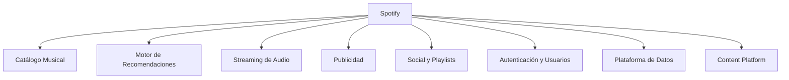

<!-- new_lines: 1 -->
# Agenda

- Sección 1: Investigación de arquitectura de Spotify
- Sección 2: Rol del arquitecto de software actual
- Sección 3: El rol del arquitecto en el futuro

<!--
speaker_note: |
  Buenas. Hoy presentamos nuestra investigación sobre la arquitectura de software de Spotify y el rol del arquitecto de software.
  El trabajo se estructura en tres secciones: la arquitectura actual de Spotify, el estado del rol del arquitecto en el mercado laboral, y cómo evolucionará este rol en la próxima década.
-->

<!-- end_slide -->

<!-- new_lines: 1 -->
# Objetivo del Trabajo

- Investigar la **arquitectura de software de Spotify** como plataforma digital de escala global
- Analizar el **rol actual del arquitecto de software** en el mercado laboral
- Proponer la **evolución del rol en los próximos 10 años** considerando inteligencia artificial y computación cuántica

<!--
speaker_note: |
  El objetivo de este trabajo es triple. Primero, investigar a fondo la arquitectura de Spotify, una de las plataformas de streaming más grandes del mundo.
  Segundo, analizar el rol actual del arquitecto de software mediante perfiles reales del mercado laboral.
  Y tercero, proyectar cómo evolucionará este rol en la próxima década frente a la inteligencia artificial y la computación cuántica.
-->

<!-- end_slide -->

<!-- new_lines: 1 -->
# Introducción

El presente trabajo analiza la **arquitectura de software de Spotify** desde tres perspectivas:

- **Sección 1**: Arquitectura actual — microservicios, tecnologías, datos, seguridad
- **Sección 2**: Rol del arquitecto de software en el mercado laboral actual
- **Sección 3**: Evolución del rol en la próxima década (IA, computación cuántica)

<!--
speaker_note: |
  Spotify es una de las plataformas de streaming de audio más grandes del mundo.
  Con más de 600 millones de usuarios activos mensuales y un catálogo superior a los 100 millones de pistas, representa un caso de estudio paradigmático sobre cómo una arquitectura bien diseñada habilita innovación continua y escalabilidad global.
-->

<!-- end_slide -->

<!-- new_lines: 1 -->
# Spotify en Cifras

- **600M+** usuarios activos mensuales
- **100M+** pistas en el catálogo
- **~1.500** microservicios
- **250+** squads autónomos
- **1 billón+** de eventos diarios procesados
- Infraestructura sobre **Google Cloud Platform**

<!--
speaker_note: |
  Estas cifras nos dan una idea de la escala a la que opera Spotify.
  Mil quinientos microservicios gestionados por más de 250 equipos autónomos, procesando más de un billón de eventos al día.
  Toda esta infraestructura corre sobre Google Cloud Platform desde 2018.
-->

<!-- end_slide -->

<!-- new_lines: 1 -->
# Sección 1: Arquitectura de Spotify
## Tipo de Arquitectura

- **Microservicios** (~1.500 servicios independientes)
- **Event-Driven** con Apache Kafka como backbone
- **Comunicación dual**: REST/gRPC (síncrono) + Kafka/PubSub (asíncrono)
- **Backend for Frontend**: APIs por tipo de cliente
- **API Gateway**: Apollo GraphQL
- **Strangler Fig**: migración progresiva desde el monolito

<!--
speaker_note: |
  Entremos en la primera sección. Spotify opera bajo una arquitectura de microservicios con un modelo event-driven.
  La comunicación entre sus 1.500 servicios se resuelve mediante canales síncronos como REST y gRPC, y asíncronos con Apache Kafka como backbone principal.
  Utilizan Apollo GraphQL como API Gateway unificado para todos los clientes y aplican el patrón Strangler Fig para migrar progresivamente desde el monolito original.
-->

<!-- end_slide -->

<!-- new_lines: 1 -->
# Sección 1: Arquitectura de Spotify
## Patrones Arquitectónicos

- **Microservicios**: despliegue y BD independientes por servicio
- **Event-Driven**: Kafka procesa billones de eventos/día
- **CQRS**: separación lectura/escritura en catálogo y playlists
- **Saga / Coreografía**: transacciones distribuidas sin orquestador
- **CDN / Edge Delivery**: distribución global multi-proveedor

<!--
speaker_note: |
  Entre los patrones identificados destacan CQRS para separar modelos de lectura y escritura en servicios de alta demanda como el catálogo y las playlists.
  Las transacciones distribuidas se coordinan mediante el patrón Saga con coreografía de eventos, sin un orquestador central.
  La distribución de contenido se apoya en una CDN multi-proveedor con puntos de presencia propios.
-->

<!-- end_slide -->

<!-- new_lines: 1 -->
# Sección 1: Arquitectura de Spotify
## Tecnologías Principales — Lenguajes

- **Java** + Spring Boot: backend predominante
- **Python**: ML, ciencia de datos, automatización
- **C++**: motor de streaming, reproductores nativos
- **Scala** (Scio): pipelines de datos sobre Apache Beam
- **TypeScript / Node.js**: frontend web y servicios ligeros

<!--
speaker_note: |
  Spotify es notablemente políglota. Java con Spring Boot domina el backend de los microservicios core. Python, el lenguaje original del monolito, hoy se usa en machine learning. C++ maneja los componentes de baja latencia como el motor de streaming. Scala, mediante Scio, procesa los pipelines de datos a escala.
-->

<!-- end_slide -->

<!-- new_lines: 1 -->
# Sección 1: Arquitectura de Spotify
## Tecnologías — Infraestructura

- **Google Cloud Platform**: migración total desde datacenters propios (2016-2018)
- **Kubernetes** (GKE): orquestación de contenedores
- **Docker**: empaquetado estándar
- **CDN multi-proveedor**: puntos de presencia propios
- **CI/CD**: Jenkins + Spinnaker

<!--
speaker_note: |
  Entre 2016 y 2018 Spotify migró desde aproximadamente 5.000 servidores físicos en datacenters propios hacia Google Cloud Platform, en una de las migraciones a la nube más significativas de la industria.
  Hoy opera sobre Kubernetes con Docker, utiliza una CDN multi-proveedor y pipelines de CI/CD con Jenkins y Spinnaker.
  Para orquestación de batch jobs y flujos de datos utilizan Luigi y Styx, herramientas internas que automatizan procesos de ETL a escala global.
-->

<!-- end_slide -->

<!-- new_lines: 1 -->
# Sección 1: Arquitectura de Spotify
## Tecnologías — Almacenamiento y Mensajería

- **Apache Cassandra** (~3.000 nodos): catálogo, metadatos
- **PostgreSQL**: usuarios, cuentas, facturación
- **BigTable / BigQuery**: métricas y analítica
- **Redis / Memcached**: caché distribuida
- **Elasticsearch**: búsqueda full-text
- **Apache Kafka**: >1 billón de eventos/día

<!--
speaker_note: |
  La estrategia de almacenamiento es poliglota: Cassandra con unos 3.000 nodos aloja los metadatos del catálogo, PostgreSQL gestiona datos relacionales, Redis y Memcached proporcionan la capa de caché esencial para latencias inferiores a 200 ms, y Elasticsearch indexa el catálogo para búsqueda.
  Apache Kafka es el sistema nervioso de la plataforma, procesando más de un billón de eventos al día.
-->

<!-- end_slide -->

<!-- new_lines: 1 -->
# Sección 1: Arquitectura de Spotify
## Componentes de la Solución

<!--
speaker_note: |
  La funcionalidad de Spotify se articula en ocho dominios de servicios core.
  Veamos brevemente cada uno.
-->

<!-- end_slide -->

<!-- new_lines: 1 -->
# Sección 1: Arquitectura de Spotify
## Catálogo y Recomendaciones

<!-- column_layout: [1, 1] -->

<!-- column: 0 -->

**Catálogo Musical**
- Metadata Service sobre Cassandra
- Audio Features Pipeline (ML)
- Search Service con Elasticsearch
- Cover Art Service

<!-- column: 1 -->

**Motor de Recomendaciones**
- BaRT: Bandits multi-armados
- Discover Weekly / Release Radar
- Daily Mix
- Taste Profile: vectores densos
- DJ AI (2023): IA generativa

<!-- reset_layout -->

<!--
speaker_note: |
  El catálogo musical con más de 100 millones de pistas se apoya en Cassandra para metadatos y Elasticsearch para búsqueda.
  El motor de recomendaciones es el diferenciador competitivo más importante: BaRT equilibra explotación y exploración, y productos como Discover Weekly combinan filtrado colaborativo con procesamiento de lenguaje natural.
  Spotify utiliza un enfoque "Algotorial" que fusiona curaduría editorial humana con señales algorítmicas, logrando un balance entre relevancia computacional y criterio experto.
  En 2023 lanzaron DJ AI, que utiliza inteligencia artificial generativa y voz sintética.
-->

<!-- end_slide -->

<!-- new_lines: 1 -->
# Sección 1: Arquitectura de Spotify
## Streaming y Publicidad

<!-- column_layout: [1, 1] -->

<!-- column: 0 -->

**Streaming de Audio**
- Códecs: OGG Vorbis, AAC
- VBR adaptativo a red
- Spotify Connect
- Offline con cifrado local

<!-- column: 1 -->

**Publicidad (Free Tier)**
- Ad Insertion dinámico
- Segmentación de audiencias
- Subasta en tiempo real
- Analytics de atribución

<!-- reset_layout -->

<!--
speaker_note: |
  El streaming utiliza códecs OGG Vorbis y AAC con bitrate variable que se adapta dinámicamente a las condiciones de red.
  Spotify Connect sincroniza el estado entre dispositivos.
  En el nivel gratuito, el Ad Insertion Service inserta anuncios dinámicamente con segmentación avanzada y subasta en tiempo real.
-->

<!-- end_slide -->

<!-- new_lines: 1 -->
# Sección 1: Arquitectura de Spotify
## Social, Auth y Plataforma de Datos

<!-- column_layout: [1, 1] -->

<!-- column: 0 -->

**Social y Playlists**
- Playlist Service + CRDTs
- Social Graph
- Collaborative Playlists
- Activity Feed

**Auth y Usuarios**
- OAuth 2.0 + SSO
- Planes: Free, Premium, Duo, Family
- Payment Service multi-país

<!-- column: 1 -->

**Plataforma de Datos**
- ~1 billón eventos/día
- Scio (Scala + Apache Beam)
- Feature Store centralizado
- ABBA: experimentación A/B masiva

<!-- reset_layout -->

<!--
speaker_note: |
  Las playlists colaborativas utilizan CRDTs para permitir edición simultánea sin servidor central de coordinación.
  La plataforma ABBA permite ejecutar experimentos A/B a escala de cientos de millones de usuarios simultáneamente, siendo una de las infraestructuras de experimentación más grandes del mundo.
-->

<!-- end_slide -->

<!-- new_lines: 1 -->
# Sección 1: Arquitectura de Spotify
## Content Platform

<!-- column_layout: [1, 1] -->

<!-- column: 0 -->

**Ingestión de Contenido**
- Ingestion Pipeline automatizado
- Recepción de sellos discográficos
- Distribuidores digitales integrados

<!-- column: 1 -->

**Herramientas para Creadores**
- Spotify for Artists
- Spotify for Labels
- Spotify for Podcasters
- Rights Management (regalías, licencias)

<!-- reset_layout -->

<!--
speaker_note: |
  Spotify opera también una plataforma de contenido completa. El Ingestion Pipeline automatiza la recepción de material desde sellos discográficos y distribuidores digitales.
  Spotify for Artists, Labels y Podcasters son los portales donde los creadores gestionan su presencia en la plataforma.
  El Rights Management gestiona los derechos de autor, licencias, y el cálculo y liquidación de regalías a los titulares de derechos — una pieza crítica del ecosistema.
-->

<!-- end_slide -->

<!-- new_lines: 1 -->
# Sección 1: Arquitectura de Spotify
## Evolución Histórica

- **Fase 1 — Monolito (2006-2012)**: Python/Django, C++, PostgreSQL
- **Fase 2 — SOA incipiente (2012-2015)**: Cassandra, Kafka, Docker, squads
- **Fase 3 — Cloud + microservicios (2016-2018)**: GCP, Kubernetes, ~1.500 servicios
- **Fase 4 — Madurez (2018-2020)**: GraphQL, gRPC, Backstage open source
- **Fase 5 — Expansión e IA (2021-presente)**: Podcast, DJ AI, >1B eventos/día

<!--
speaker_note: |
  La arquitectura de Spotify ha transitado por cinco fases diferenciadas.
  Partió de un monolito Python/Django en 2006, evolucionó hacia SOA con Cassandra y Kafka, migró integralmente a Google Cloud entre 2016 y 2018, maduró con GraphQL y Backstage, y hoy se expande con IA generativa y nuevos formatos como podcast y audiolibros.
-->

<!-- end_slide -->

<!-- new_lines: 1 -->
# Sección 1: Arquitectura de Spotify
## Manejo de Datos

- **PostgreSQL**: perfiles, suscripciones, facturación
- **Apache Cassandra**: historial de reproducción, eventos masivos
- **Apache Kafka**: cada interacción genera eventos → consumidores
- Procesamiento en **tiempo real** sin afectar experiencia del usuario
- Desacoplamiento total entre microservicios

<!--
speaker_note: |
  Spotify utiliza una arquitectura de datos distribuida donde cada motor se especializa en un tipo específico de información.
  Cada interacción del usuario genera eventos en Kafka que alimentan sistemas analíticos, motores de recomendación y procesos de machine learning, todo en tiempo real y sin afectar la experiencia del usuario.
-->

<!-- end_slide -->

<!-- new_lines: 1 -->
# Sección 1: Arquitectura de Spotify
## Seguridad

- **OAuth 2.0**: autenticación de usuarios y apps de terceros
- **Mínimo privilegio**: cada microservicio accede solo a lo necesario
- **TLS + HTTPS**: cifrado en tránsito
- **AES-256**: cifrado en reposo
- **DRM**: protección de contenido con licencias y restricciones geográficas

<!--
speaker_note: |
  La seguridad es un pilar fundamental. Spotify implementa OAuth 2.0 para autenticación, políticas de mínimo privilegio entre microservicios, cifrado AES-256 en reposo y TLS en tránsito, además de DRM para proteger los derechos de autor del contenido.
-->

<!-- end_slide -->

<!-- new_lines: 1 -->
# Sección 1: Arquitectura de Spotify
## Escalabilidad y Disponibilidad

<!-- column_layout: [1, 1] -->

<!-- column: 0 -->

**Escalabilidad**
- Kubernetes con autoescalado
- CDN multi-proveedor global
- Sharding de bases de datos
- Escalado independiente por servicio

<!-- column: 1 -->

**Disponibilidad**
- Replicación multi-datacenter
- Self-healing con Kubernetes
- Prometheus + Grafana
- Backups periódicos
- Recuperación ante desastres

<!-- reset_layout -->

<!--
speaker_note: |
  Para la escalabilidad, Spotify utiliza autoescalado de Kubernetes, CDN global y sharding de bases de datos.
  Para la disponibilidad, replica datos en múltiples centros distribuidos geográficamente, Kubernetes reinicia servicios fallidos automáticamente, y herramientas como Prometheus y Grafana permiten monitoreo continuo y detección rápida de incidentes.
  En observabilidad, Spotify desarrolló herramientas internas como Heroic y Ffwd —liberadas como open source— para manejar series temporales a la escala de cientos de millones de usuarios.
-->

<!-- end_slide -->

<!-- new_lines: 1 -->
# Sección 1: Arquitectura de Spotify
## Diagrama de Arquitectura

<!--
speaker_note: |
  Este es el diagrama de arquitectura de Spotify, que muestra la estructura de microservicios, los flujos de datos y las integraciones entre los distintos componentes de la plataforma.
-->

<!-- end_slide -->

<!-- new_lines: 1 -->
# Sección 1: Arquitectura de Spotify
## Diagrama de Arquitectura (2)

<!--
speaker_note: |
  La segunda parte del diagrama detalla componentes adicionales de la plataforma, incluyendo los sistemas de recomendación, procesamiento de datos y distribución de contenido.
-->

<!-- end_slide -->

<!-- new_lines: 1 -->
# Sección 1: Arquitectura de Spotify
## Decisiones Arquitectónicas Clave
### ADR-1: Monolito → Microservicios

- **Contexto**: monolito Python/Django era cuello de botella organizacional
- **Decisión**: descomponer en microservicios independientes
- **Resultado**: 250+ squads despliegan en paralelo, time-to-market reducido
- **Contrapartida**: complejidad en orquestación, service discovery, consistencia eventual

<!--
speaker_note: |
  Ahora analizamos las decisiones arquitectónicas más importantes que dieron forma a Spotify, documentadas como Architecture Decision Records.
  Hacia 2012, un solo codebase impedía que múltiples equipos desplegaran de forma independiente. La descomposición en microservicios permitió que más de 250 squads desarrollaran en paralelo.
  La contrapartida fue una complejidad operativa significativa que Spotify gestionó construyendo herramientas como Backstage.
-->

<!-- end_slide -->

<!-- new_lines: 1 -->
# Sección 1: Arquitectura de Spotify
## Decisiones Arquitectónicas Clave
### ADR-2: Google Cloud | ADR-3: Cassandra

<!-- column_layout: [1, 1] -->

<!-- column: 0 -->

**ADR-2: Google Cloud**
- 5.000 servidores → GCP
- Reducción de TCO
- Acceso a servicios managed
- Riesgo: vendor lock-in

<!-- column: 1 -->

**ADR-3: Cassandra**
- PostgreSQL no escalaba horizontalmente
- Arquitectura masterless
- Replicación multirregión
- Contrapartida: consistencia eventual

<!-- reset_layout -->

<!--
speaker_note: |
  Mantener datacenters propios desviaba talento hacia tareas de bajo valor. La migración a GCP permitió reducir costos y acceder a BigQuery y Dataflow.
  PostgreSQL no escalaba al ritmo del catálogo, así que Cassandra aportó escalabilidad horizontal sin punto único de fallo, aunque a costa de un modelo de consistencia eventual.
-->

<!-- end_slide -->

<!-- new_lines: 1 -->
# Sección 1: Arquitectura de Spotify
## Decisiones Arquitectónicas Clave
### ADR-4: Apache Kafka | ADR-5: Apollo GraphQL

<!-- column_layout: [1, 1] -->

<!-- column: 0 -->

**ADR-4: Apache Kafka**
- Desacopla productores y consumidores
- Garantiza orden y durabilidad
- Permite reprocesamiento histórico
- Contrapartida: complejidad operativa

<!-- column: 1 -->

**ADR-5: Apollo GraphQL**
- Cada cliente declara sus datos
- Optimiza ancho de banda
- Reduce latencia percibida
- Contrapartida: DataLoaders necesarios

<!-- reset_layout -->

<!--
speaker_note: |
  Con cientos de microservicios, la comunicación punto a punto era insostenible. Kafka desacopla productores y consumidores y permite replay histórico de eventos.
  GraphQL permite que cada tipo de cliente declare exactamente los datos que necesita, optimizando ancho de banda y evitando over-fetching y under-fetching.
-->

<!-- end_slide -->

<!-- new_lines: 1 -->
# Sección 1: Arquitectura de Spotify
## Decisiones Arquitectónicas Clave
### ADR-6: Modelo de Squads | ADR-7: Backstage

<!-- column_layout: [1, 1] -->

<!-- column: 0 -->

**ADR-6: Modelo de Squads**
- 5-8 ingenieros por squad
- "You build it, you run it"
- Ley de Conway aplicada
- Riesgo: fragmentación tecnológica

<!-- column: 1 -->

**ADR-7: Backstage**
- Catálogo centralizado de servicios
- Documentación viva desde código
- Scaffolding automatizado
- Donado a CNCF en 2020

<!-- reset_layout -->

<!--
speaker_note: |
  Spotify adoptó el modelo de squads, tribes, chapters y guilds. Cada squad es dueño de una misión de negocio y de los microservicios que la implementan, bajo el principio "You build it, you run it".
  Backstage unifica la visibilidad de todo el ecosistema en un solo lugar. Spotify lo donó a la CNCF en 2020, donde hoy es un proyecto incubado.
-->

<!-- end_slide -->

<!-- new_lines: 1 -->
# Sección 1: Arquitectura de Spotify
## Decisiones Arquitectónicas Clave
### ADR-8: Caché Distribuida (Redis + Memcached)

- **Contexto**: streaming exige latencias < 200 ms; consultar BD por reproducción es inviable
- **Decisión**: capa de caché distribuida con Redis y Memcached para sesión y catálogo frecuente
- **Resultado**: reducción drástica de carga sobre Cassandra y PostgreSQL
- **Contrapartida**: inconsistencia temporal caché-BD, gestionada con TTL e invalidación diferenciada

<!--
speaker_note: |
  El último ADR documentado aborda la caché distribuida.
  Con latencias requeridas inferiores a 200 milisegundos para una experiencia de streaming fluida, consultar la base de datos en cada reproducción sería inviable.
  Redis y Memcached proporcionan una capa de caché que reduce la carga sobre Cassandra y PostgreSQL.
  La contrapartida es la inconsistencia temporal entre caché y base de datos, gestionada mediante tiempos de expiración y estrategias de invalidación diferenciadas por tipo de dato.
-->

<!-- end_slide -->

<!-- new_lines: 1 -->
# Sección 1: Arquitectura de Spotify
## Conclusión

- Arquitectura de **microservicios event-driven** diseñada para escala global
- **Tecnologías**: Kubernetes, Kafka, Cassandra, PostgreSQL, GCP
- **Decisiones clave** con ADRs documentados y contrapartidas gestionadas
- **Alineación** entre estructura organizacional (squads) y arquitectura técnica
- Sistema **confiable, flexible y preparado** para evolucionar

<!--
speaker_note: |
  En conclusión, el éxito de Spotify se sustenta en una arquitectura de microservicios basada en eventos, con tecnologías como Kubernetes, Kafka y Cassandra, y decisiones arquitectónicas bien documentadas.
  La alineación entre squads autónomos y microservicios es una manifestación concreta de la Ley de Conway.
-->

<!-- end_slide -->

<!-- new_lines: 1 -->
# Sección 2: Rol del Arquitecto de Software Actual
## Perfiles Analizados

- **Spotify** — Staff Software Architect (Suecia, Híbrido)
- **Globant** — Software Architect Cloud Solutions (EE.UU., Remoto)
- **Mercado Libre** — Arquitecto de Software Senior (Argentina, Híbrido)

Fuentes: LinkedIn, Glassdoor, Get on Board (2026)

<!--
speaker_note: |
  Pasamos a la segunda sección, donde investigamos el estado actual del rol del arquitecto de software.
  Analizamos tres perfiles reales: un Staff Software Architect en Spotify, un Cloud Software Architect en Globant y un Arquitecto de Software Senior en Mercado Libre.
  Las fuentes fueron LinkedIn Recruiter, Glassdoor y Get on Board, consultadas en 2026.
-->

<!-- end_slide -->

<!-- new_lines: 1 -->
# Sección 2: Rol del Arquitecto de Software Actual
## Coincidencias Clave

- **Cloud e Infraestructura Inmutable**: dominio obligatorio de AWS/GCP/Azure, Docker y Kubernetes
- **Sistemas de Datos**: Apache Kafka, bases distribuidas, Redis
- **Habilidades Blandas**: mentoría, negociación, liderazgo de influencia
- El arquitecto moderno pasa gran parte de su tiempo **comunicando e influenciando**

<!--
speaker_note: |
  Las tres coincidencias principales son: dominio obligatorio de cloud y contenedores en todas las geografías; experiencia en Kafka y bases distribuidas como requisito transversal; y la importancia extrema de las habilidades blandas.
  A diferencia de roles puramente técnicos, el arquitecto pasa gran parte de su tiempo comunicando, negociando e influenciando.
-->

<!-- end_slide -->

<!-- new_lines: 1 -->
# Sección 2: Rol del Arquitecto de Software Actual
## Diferencias Significativas

- **Escala organizacional**: Spotify → hiperescala; Globant → consultoría y FinOps
- **Brecha salarial**: Norteamérica/Europa ($120K-$185K) vs LATAM ($60K-$75K)
- Mismas exigencias técnicas conceptuales, **compensaciones ligadas a la ubicación**

<!--
speaker_note: |
  Las principales diferencias están en el contexto: Spotify se enfoca en hiperescala y resiliencia, mientras Globant tiene un matiz de consultoría y gobernanza de costos.
  La brecha salarial es marcada: entre 120 y 185 mil dólares en Norteamérica y Europa frente a 60-75 mil en Latinoamérica, pese a que las exigencias técnicas son muy similares.
-->

<!-- end_slide -->

<!-- new_lines: 1 -->
# Sección 2: Rol del Arquitecto de Software Actual
## Conclusión

- El arquitecto evolucionó de **diseñador técnico** a **posición estratégica**
- Conocimientos requeridos: microservicios, cloud, DevOps, ciberseguridad
- Habilidades blandas **tan importantes** como las técnicas
- Rol de **puente entre negocio y tecnología**

<!--
speaker_note: |
  El arquitecto de software ha evolucionado más allá del diseño técnico hacia una posición estratégica.
  Las empresas buscan profesionales con conocimientos en microservicios, cloud, DevOps y ciberseguridad, pero las habilidades blandas son igualmente valoradas.
  El arquitecto funciona como puente entre los objetivos del negocio y la implementación tecnológica.
-->

<!-- end_slide -->

<!-- new_lines: 1 -->
# Sección 3: El Rol del Arquitecto en el Futuro
## Transformación del Rol

El arquitecto pasará de **diseñador de estructuras técnicas** a **estratega tecnológico** que toma decisiones sobre sistemas:

- Más inteligentes y automatizados
- Más distribuidos
- Más regulados
- Con impacto ético, económico, ambiental y social

<!--
speaker_note: |
  En la tercera sección proyectamos la evolución del rol del arquitecto en la próxima década.
  Durante los próximos diez años, el arquitecto evolucionará de ser principalmente un diseñador técnico a convertirse en un estratega tecnológico.
  Deberá comprender no solo la infraestructura, sino también el impacto ético, económico, ambiental y social de sus decisiones.
-->

<!-- end_slide -->

<!-- new_lines: 1 -->
# Sección 3: El Rol del Arquitecto en el Futuro
## Impacto de la IA

<!-- column_layout: [1, 1] -->

<!-- column: 0 -->

**Oportunidades**
- Análisis masivo de información técnica
- Comparación de patrones arquitectónicos
- Detección de deuda técnica
- Documentación automática
- Optimización de costos cloud

<!-- column: 1 -->

**Desafíos**
- Precisión y alucinaciones
- Privacidad de datos
- Falta de marcos de evaluación
- La IA apoya, no decide

<!-- reset_layout -->

<!--
speaker_note: |
  La IA transformará directamente las actividades del arquitecto. Podrá analizar grandes cantidades de información, detectar deuda técnica, generar documentación y sugerir mejoras.
  Sin embargo, la IA generativa todavía enfrenta problemas de precisión, alucinaciones y falta de marcos sólidos de evaluación. La IA debe verse como herramienta de apoyo, no como reemplazo del arquitecto.
  Fuente: Esposito et al., 2025; Software Engineering Institute, 2024.
-->

<!-- end_slide -->

<!-- new_lines: 1 -->
# Sección 3: El Rol del Arquitecto en el Futuro
## Impacto de la Computación Cuántica

- IBM proyecta computadora cuántica tolerante a fallos hacia **2029**
- Oportunidades: optimización de distribución, recomendaciones, análisis de datos
- Adopción **gradual y limitada** a casos concretos
- **Impacto inmediato en seguridad**: migración a criptografía post-cuántica
- NIST publicó estándares de criptografía post-cuántica en 2024

<!--
speaker_note: |
  La computación cuántica podría influir en optimización y simulación en la próxima década. IBM proyecta una computadora cuántica tolerante a fallos hacia 2029.
  El impacto más inmediato estará en seguridad: el arquitecto deberá planificar migraciones hacia algoritmos resistentes a ataques cuánticos.
  El NIST ya publicó estándares de criptografía post-cuántica en 2024.
-->

<!-- end_slide -->

<!-- new_lines: 1 -->
# Sección 3: El Rol del Arquitecto en el Futuro
## Nuevas Responsabilidades

- **Gobernanza de IA**: sistemas auditables, explicables y controlados (ISO/IEC 42001:2023)
- **Sostenibilidad**: eficiencia energética, reducción de huella de carbono (SCI Specification)
- **Ética tecnológica**: privacidad, transparencia, responsabilidad
- **Cumplimiento normativo**: regulaciones emergentes sobre IA y datos
- **Gestión de riesgos**: anticipar consecuencias no evidentes

<!--
speaker_note: |
  El arquitecto del futuro tendrá responsabilidades más amplias: gobernanza de sistemas de IA bajo ISO 42001, sostenibilidad medida con la especificación SCI de la Green Software Foundation, ética tecnológica y cumplimiento normativo.
  Ya no bastará con que el sistema funcione; deberá ser auditable, confiable y alineado con principios de privacidad y transparencia.
-->

<!-- end_slide -->

<!-- new_lines: 1 -->
# Sección 3: El Rol del Arquitecto en el Futuro
## Habilidades a Desarrollar

<!-- column_layout: [1, 1] -->

<!-- column: 0 -->

**Técnicas**
- Arquitectura cloud nativa
- MLOps y pipelines de ML
- Gobernanza de datos
- IA generativa
- Criptografía post-cuántica
- Observabilidad avanzada

<!-- column: 1 -->

**Humanas**
- Pensamiento crítico
- Liderazgo y negociación
- Visión de negocio
- Comunicación estratégica
- Análisis de trade-offs

<!-- reset_layout -->

<!--
speaker_note: |
  El arquitecto necesitará una combinación de habilidades técnicas y humanas.
  En lo técnico: cloud, MLOps, gobernanza de datos, IA generativa y fundamentos de criptografía post-cuántica.
  En lo humano: pensamiento crítico, liderazgo, negociación y capacidad para analizar trade-offs entre rendimiento, costo, privacidad y sostenibilidad.
-->

<!-- end_slide -->

<!-- new_lines: 1 -->
# Sección 3: El Rol del Arquitecto en el Futuro
## Automatización vs. Criterio Humano

<!-- column_layout: [1, 1] -->

<!-- column: 0 -->

**Automatizable con IA**
- Documentación técnica
- Diagramas iniciales
- Análisis de dependencias
- Detección de deuda técnica
- Pruebas y reportes

<!-- column: 1 -->

**Requiere criterio humano**
- Prioridades estratégicas
- Resolución de conflictos
- Interpretación del negocio
- Evaluación ética
- Decisiones de seguridad
- Migraciones complejas

<!-- reset_layout -->

<!--
speaker_note: |
  Varias actividades podrán automatizarse: documentación, diagramas, análisis de dependencias, detección de deuda técnica.
  Pero el criterio humano seguirá siendo indispensable para prioridades estratégicas, resolver conflictos, evaluar consecuencias éticas y decidir sobre seguridad y migraciones complejas.
  El arquitecto actuará como mediador entre la automatización y la responsabilidad.
-->

<!-- end_slide -->

<!-- new_lines: 1 -->
# Sección 3: El Rol del Arquitecto en el Futuro
## Valor Diferencial del Arquitecto

- **Conectar** tecnología, negocio y responsabilidad social
- **Formular las preguntas correctas**, no solo generar opciones
- **Equilibrar**: innovación ↔ estabilidad, automatización ↔ control, personalización ↔ privacidad
- **Anticipar impactos** y diseñar arquitecturas adaptables
- No será solo un experto técnico: será un **líder de decisiones complejas**

<!--
speaker_note: |
  El valor diferencial del arquitecto estará en conectar tecnología, negocio y responsabilidad social.
  Mientras la IA podrá generar opciones, el arquitecto deberá formular las preguntas correctas, evaluar riesgos y asegurar que la arquitectura sea sostenible en el tiempo.
  No será solo un experto técnico, sino un líder de decisiones complejas.
-->

<!-- end_slide -->

<!-- new_lines: 1 -->
# Sección 3: El Rol del Arquitecto en el Futuro
## Riesgos y Oportunidades

<!-- column_layout: [1, 1] -->

<!-- column: 0 -->

**Oportunidades**
- Herramientas más avanzadas
- Automatización de tareas repetitivas
- Más tiempo para decisiones estratégicas
- Nuevos enfoques (cuántica)

<!-- column: 1 -->

**Riesgos**
- Dependencia excesiva de la IA
- Deuda técnica acelerada
- Sesgos algorítmicos
- Aumento del consumo energético
- Dificultad regulatoria

<!-- reset_layout -->

<!--
speaker_note: |
  Las oportunidades incluyen herramientas más avanzadas, automatización de tareas repetitivas y más tiempo para lo estratégico.
  Los riesgos abarcan la dependencia excesiva de la IA sin validación, generación de deuda técnica a gran velocidad, sesgos algorítmicos y aumento del consumo energético.
-->

<!-- end_slide -->

<!-- new_lines: 1 -->
# Sección 3: El Rol del Arquitecto en el Futuro
## Conclusión

- El arquitecto **no desaparecerá**: se volverá más estratégico, interdisciplinario y crítico
- La IA automatiza tareas, pero el **criterio humano** sigue siendo indispensable
- Deberá diseñar sistemas que integren IA, prepararse para seguridad post-cuántica y garantizar confianza
- **La diferencia**: saber cuándo usar nuevas tecnologías, cómo gobernarlas y qué consecuencias generan

<!--
speaker_note: |
  En conclusión, el rol del arquitecto de software no desaparecerá. Se volverá más estratégico, interdisciplinario y crítico.
  La diferencia no estará solo en conocer nuevas tecnologías, sino en saber cuándo usarlas, cómo gobernarlas y qué consecuencias pueden generar.
-->

<!-- end_slide -->

<!-- new_lines: 1 -->
# Conclusión General
## Síntesis del Trabajo

- Spotify demuestra que una **arquitectura bien diseñada** habilita escala global e innovación continua
- El arquitecto moderno es un **puente estratégico** entre negocio y tecnología
- El futuro exige **nuevas competencias**: IA, ciberseguridad, sostenibilidad, ética
- El arquitecto seguirá siendo **indispensable** como líder de decisiones complejas

<!--
speaker_note: |
  Llegamos a la conclusión general de nuestra investigación.
  Nuestro trabajo evidencia que el éxito de Spotify reside en una arquitectura cuidadosamente diseñada que equilibra escalabilidad, disponibilidad, seguridad y capacidad de innovación.
  El arquitecto moderno trasciende lo técnico para convertirse en puente estratégico.
  Y el futuro exigirá nuevas competencias sin eliminar la necesidad del criterio humano.
-->

<!-- end_slide -->

<!-- new_lines: 1 -->
# Referencias

- Kniberg, H. y Ivarsson, A. (2012). *Scaling Agile @ Spotify*
- Kreitz, G. y Niemelä, F. (2010). *Spotify — Large scale, low latency, P2P streaming*
- Newman, S. (2021). *Building Microservices* (2.ª ed.). O'Reilly
- Esposito et al. (2025). *Generative AI for Software Architecture*. arXiv
- ISO/IEC 42001:2023. *AI Management System*
- NIST (2024). *Post-Quantum Cryptography Standards*
- IBM (2025). *Fault-Tolerant Quantum Computing Roadmap*
- Spotify Engineering (2024). *Engineering Blog*
- Apache Kafka, Cassandra, Kubernetes Documentation (2024)
- Google Cloud Architecture Framework (2024)

<!--
speaker_note: |
  Estas son las principales referencias consultadas para este trabajo. Se utilizaron fuentes académicas, técnicas y de la industria, incluyendo papers originales de ingenieros de Spotify, documentación oficial de tecnologías como Kafka y Cassandra, y estándares recientes de ISO y NIST.
  La lista completa de referencias en formato APA se encuentra en el documento de investigación.
-->

<!-- end_slide -->

<!-- new_lines: 1 -->
# ¡Gracias!

¿Preguntas?

<!--
speaker_note: |
  Muchas gracias por su atención. Quedamos abiertos a preguntas y comentarios.
-->
